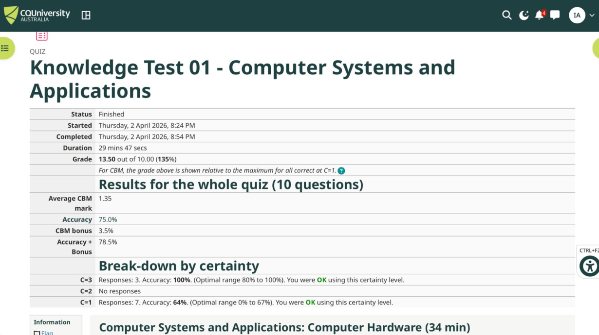
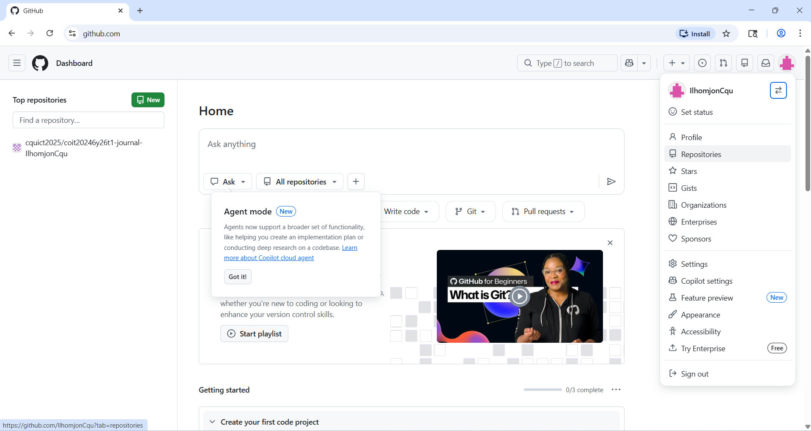

# Week 1 | Unit Introduction
Student Name: Ilkhomjon Abdukarimov
Student ID: 12326456
Campus: Melbourne

## Task 1. Complete the Knowledge Test for Week 00

## Task 2. Watch the Welcome to COIT20246 Video
[Completed]

## Task 3. Explore the Moodle Site
[Completed]

## Task 4. Create GitHub Account

## Task 5. Write Your Entry for Week 1 Journal

I am new to the field of networking and cyber security. 
I have basic awareness of some concepts from my general 
computer science background, but I am looking forward to 
learning more in this unit.

---

### Computer Networking

- I know that networks connect computers together to share 
  information and resources
- I am aware of basic network devices such as routers, 
  switches, and modems
- I have used home Wi-Fi and understand that devices are 
  assigned IP addresses to communicate
- I have heard of terms like IP address, DNS, and firewall 
  but have not configured them professionally

*Learned through:* General computer use and basic IT awareness 
from high school and everyday technology experience.

---

### The Internet

- I use the Internet daily and understand it connects 
  devices worldwide
- I know that websites use HTTP/HTTPS protocols 
  (the padlock icon means a secure connection)
- I understand that DNS converts website names like 
  google.com into IP addresses
- I am aware that data is broken into packets and 
  sent across networks

*Learned through:* Everyday Internet use and general 
awareness from prior schooling.

---

### Cyber Security

- I am aware of common threats like viruses, phishing 
  emails, and scams
- I know the importance of strong passwords and 
  two-factor authentication (2FA)
- I understand that firewalls and antivirus software 
  help protect computers
- I have heard of terms like encryption and data breach 
  but have not studied them in depth

*Learned through:* General awareness from news, 
social media, and everyday computer use.

---

### Cloud Computing

- I use cloud services in daily life such as 
  Google Drive, iCloud, and OneDrive
- I understand that cloud computing means storing 
  and accessing data over the Internet instead of 
  on a local hard drive
- I am aware of major cloud providers such as 
  AWS, Microsoft Azure, and Google Cloud
- I have not yet worked with cloud platforms 
  professionally but am eager to learn

*Learned through:* Personal use of cloud-based 
applications and general awareness.

---

### Tools I Have Used

| Category          | Tools / Experience                        |
|-------------------|-------------------------------------------|
| Operating System  | Windows (daily use)                       |
| Internet Browser  | Chrome, Firefox                           |
| Cloud Storage     | Google Drive, OneDrive                    |
| Office Tools      | Microsoft Word, Excel, PowerPoint         |
| Communication     | Microsoft Teams, Email                    |

---

The following is a screenshot of my Knowledge Test score:

## Task 6. Visit the Microsoft Teams Site

[Completed]

