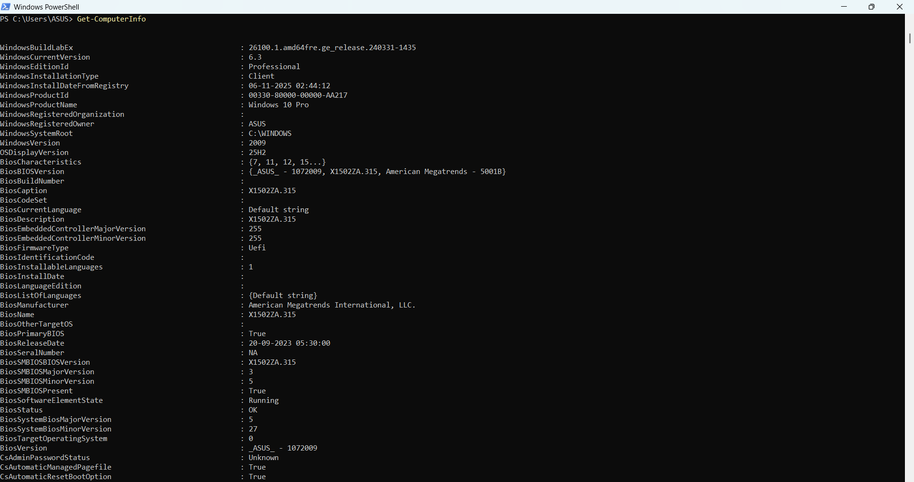
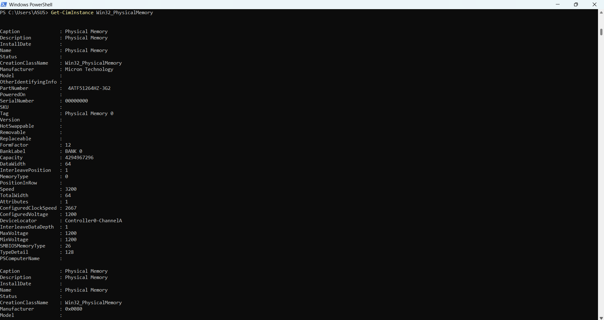
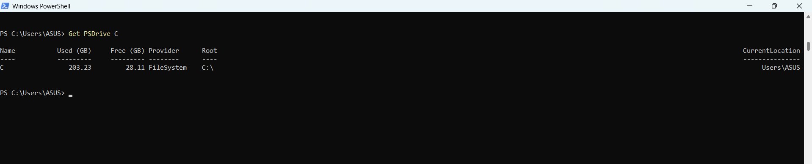
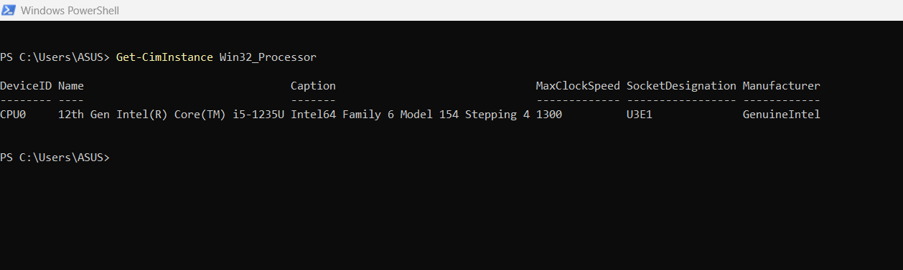
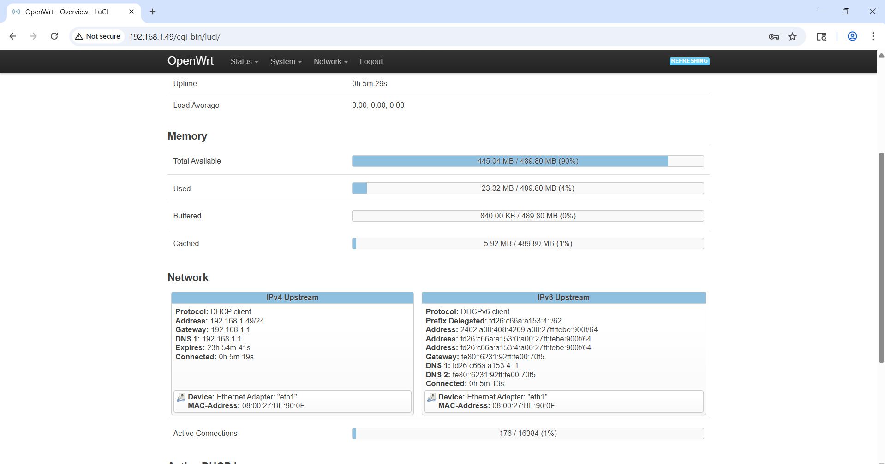
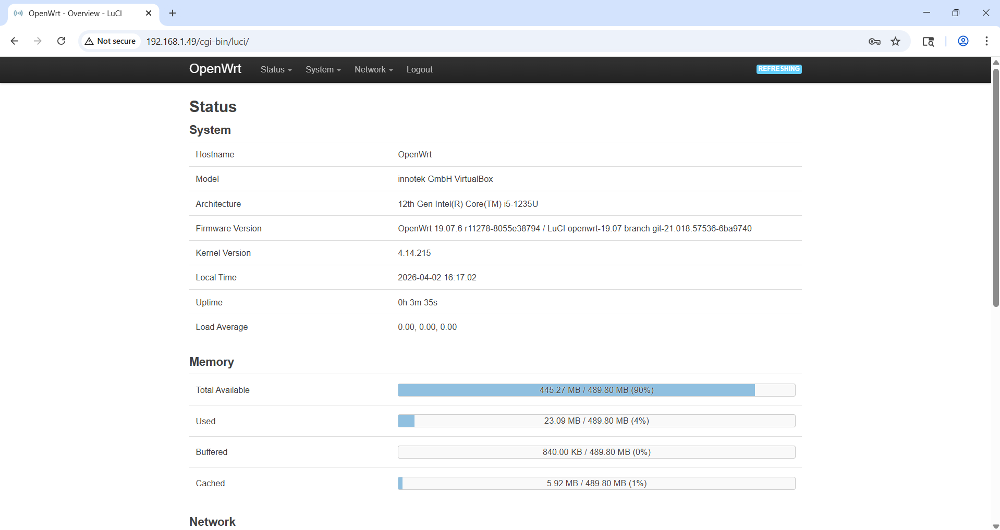
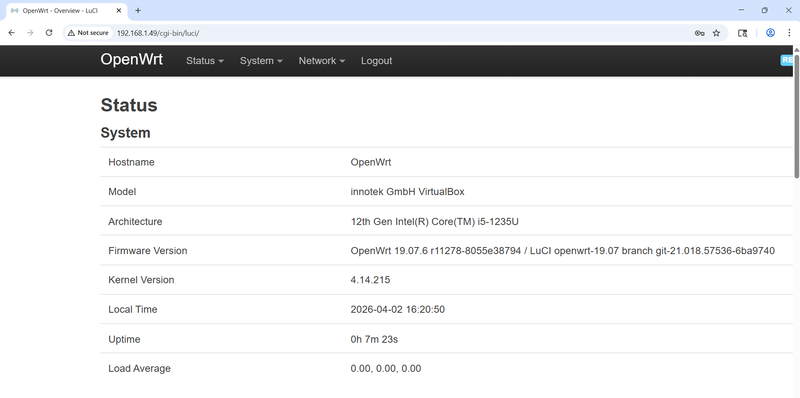

# Week 2 | Computer Systems and Applications 
Student Name: Ilkhomjon Abdukarimov
Student ID: 12326456
Campus: Melbourne

## Task 1. Complete the Knowledge Test
The following is a screenshot of my Knowledge Test score:

## Task 2. View Your Computer Information

## Task 3. Deploy Linux Web Server in VirtualBox

### Boot Manager
- **Name:** GRUB (GRand Unified Bootloader)
- **Version:** GRUB 2
- **How I found it:** The boot manager name and version appeared on screen during the VM startup sequence before the OS loaded.

### Kernel
- **Name:** Linux
- **Version:** 5.15.x (confirmed by running `uname -r` in the OpenWRT terminal)
- **How I found it:** After the VM booted, I typed `uname -r` in the OpenWRT shell and it returned the kernel version.

### My Description of VirtualBox and OpenWRT
**VirtualBox** is a free, open-source virtualization software by Oracle that lets you run multiple operating systems inside your existing computer. Each virtual machine has its own simulated CPU, RAM, and storage, making it great for testing and learning without needing extra hardware.

**OpenWRT** is a lightweight, open-source Linux-based operating system designed for network devices like routers. It replaces standard router firmware with a fully customizable system, allowing users to manage firewall rules, network settings, and install packages through a web interface called LuCI.

### AI-Generated Description
**Prompt used:** *"Describe VirtualBox and OpenWRT in one short paragraph each for a new IT student."*

**AI Response:**
VirtualBox is a free virtualization platform by Oracle that lets you run multiple operating systems on a single physical computer by creating virtual machines with their own virtual hardware. OpenWRT is a Linux-based open-source firmware for routers and network devices that replaces default manufacturer firmware, giving users advanced control over routing, firewalling, and network services.

### Comparison
Both descriptions cover the same core facts. My description focuses more on *why* these tools are useful for students and explains the host/guest relationship in VirtualBox more clearly. The AI response is more concise and technical but lacks the hands-on context. Both agree that VirtualBox is by Oracle, is free, and uses virtualization, and that OpenWRT is Linux-based and open-source.

## Task 4. Browse to OpenWRT Websites

