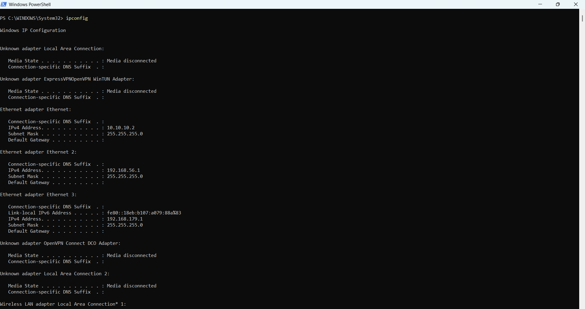
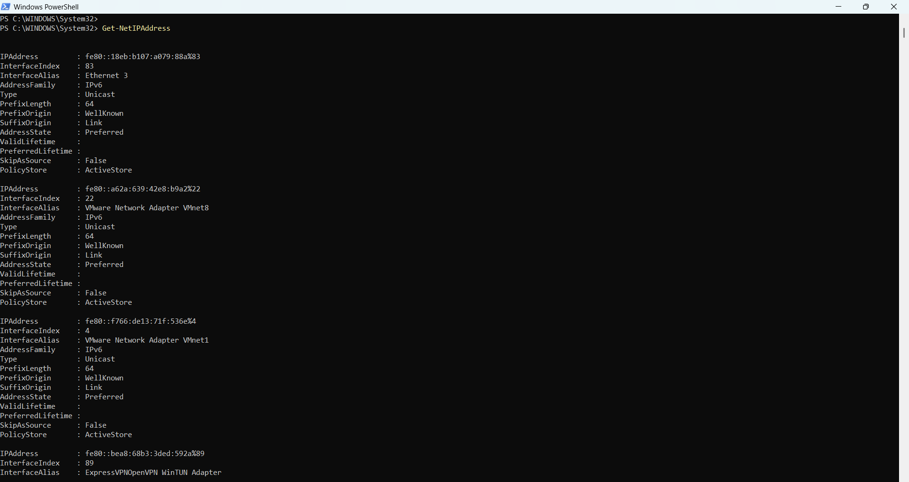
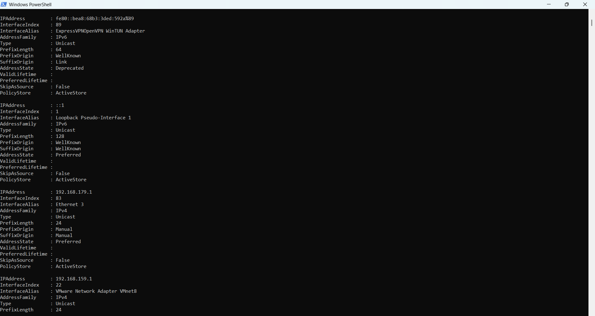
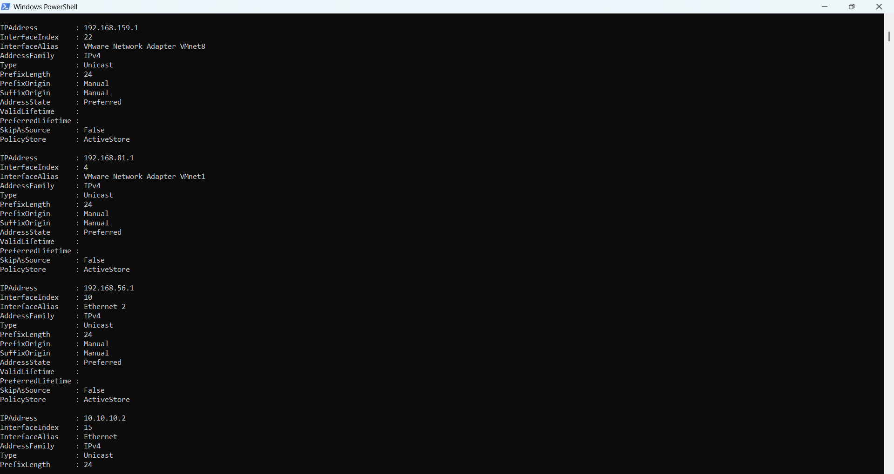
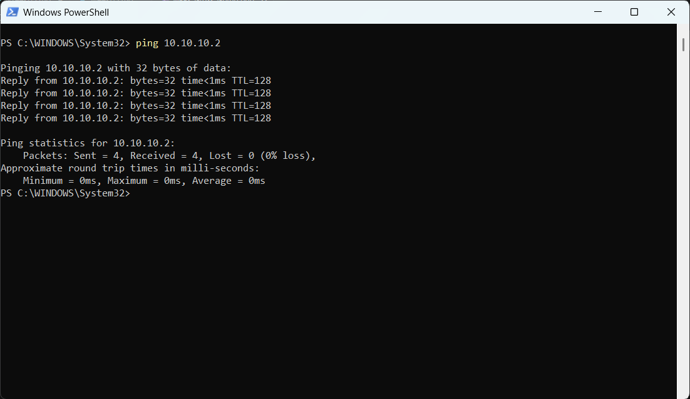
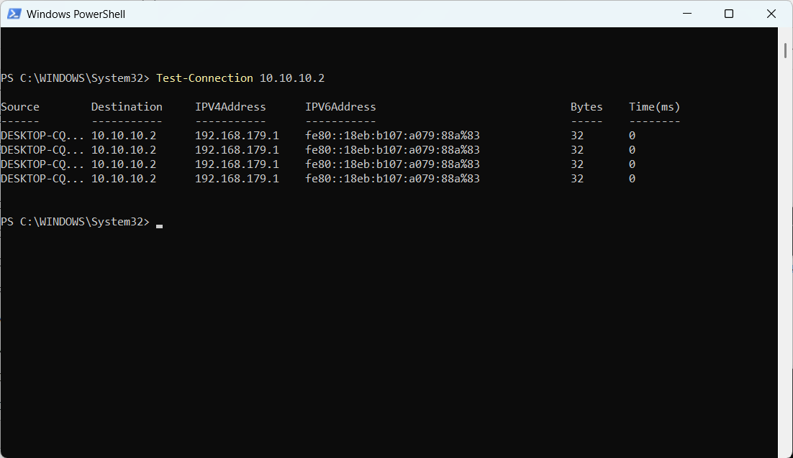
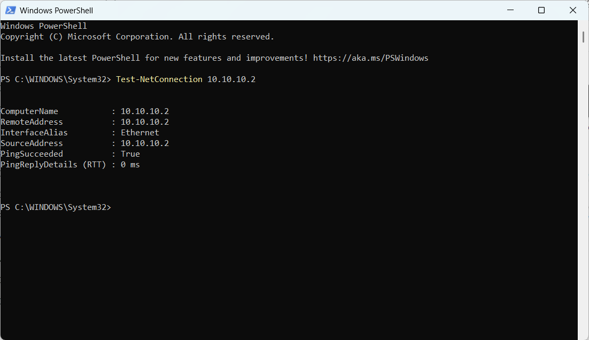
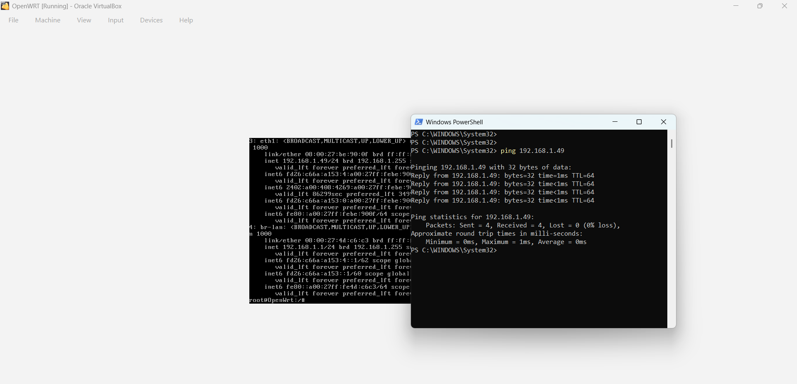
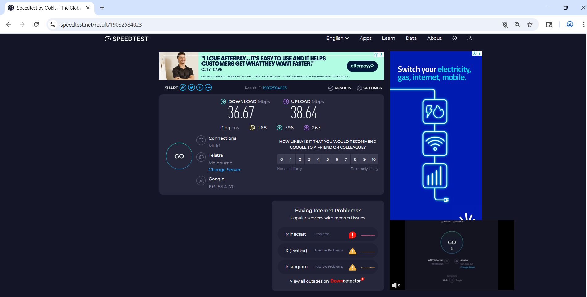
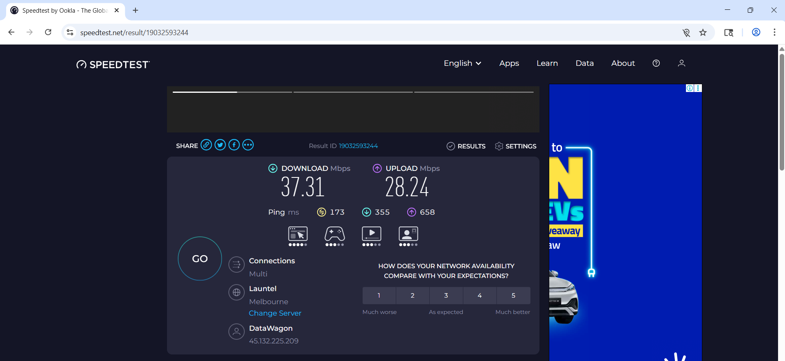

# Week 3 | Computer Networks and the Internet 
Student Name: Ilkhomjon Abdukarimov
Student ID: 12326456
Campus: Melbourne


## Task 1. Complete the Knowledge Test for Week 3
The following is a screenshot of my Knowledge Test score:


## Task 2. View Your Addresses






## Task 3. Ping Your Local Router




PS C:\WINDOWS\System32> Test-NetConnection 10.10.10.2
ComputerName           : 10.10.10.2
RemoteAddress          : 10.10.10.2
InterfaceAlias         : Ethernet
SourceAddress          : 10.10.10.2
PingSucceeded          : True
PingReplyDetails (RTT) : 0 ms


PS C:\WINDOWS\System32> Test-Connection 10.10.10.2

Source        Destination     IPV4Address      IPV6Address                              Bytes    Time(ms)
------        -----------     -----------      -----------                              -----    --------
DESKTOP-CQ... 10.10.10.2      192.168.179.1    fe80::18eb:b107:a079:88a%83              32       0
DESKTOP-CQ... 10.10.10.2      192.168.179.1    fe80::18eb:b107:a079:88a%83              32       0
DESKTOP-CQ... 10.10.10.2      192.168.179.1    fe80::18eb:b107:a079:88a%83              32       0
DESKTOP-CQ... 10.10.10.2      192.168.179.1    fe80::18eb:b107:a079:88a%83              32       0


PS C:\WINDOWS\System32> ping 10.10.10.2

Pinging 10.10.10.2 with 32 bytes of data:
Reply from 10.10.10.2: bytes=32 time<1ms TTL=128
Reply from 10.10.10.2: bytes=32 time<1ms TTL=128
Reply from 10.10.10.2: bytes=32 time<1ms TTL=128
Reply from 10.10.10.2: bytes=32 time<1ms TTL=128

Ping statistics for 10.10.10.2:
    Packets: Sent = 4, Received = 4, Lost = 0 (0% loss),
Approximate round trip times in milli-seconds:
    Minimum = 0ms, Maximum = 0ms, Average = 0ms
PS C:\WINDOWS\System32>

## Task 4. Ping your OpenWRT Linux Server



## Task 5. Academic Integrity Policy
| Level   | Official Name                   | Breach Type   |
| ------- | ------------------------------- | ------------- |
| Level 1 | Inappropriate Academic Conduct  | Breach Type 1 |
| Level 2 | Minor Academic Misconduct       | Breach Type 2 |
| Level 3 | Moderate Academic Misconduct    | Breach Type 2 |
| Level 4 | Substantial Academic Misconduct | Breach Type 2 |
| Level 5 | Serious Academic Misconduct     | Breach Type 2 |


## Task 6. Print GitHub Journal Page to PDF

[Completed]


## Task 7. Find Addresses of a Website
---

### Selected Website

**Website:** `https://www.google.com`
**Owner:** Google LLC, Mountain View, California, USA
**Note:** Google.com is one of the most well-known and widely used websites in the world, making it easy to look up and verify address information across multiple tools.

---

### Commands Used to Find Addresses

All commands run in **Windows PowerShell**:

```powershell
# 1. Find IPv4 address (A record)
nslookup google.com

# 2. Find IPv6 address (AAAA record)
nslookup -type=AAAA google.com

# 3. Find Name Servers (NS record)
nslookup -type=NS google.com

# 4. Find Mail Servers (MX record)
nslookup -type=MX google.com

# 5. Ping to confirm reachability
ping google.com

# 6. Trace route to the server
tracert google.com
```

**WHOIS lookup** performed at: [https://www.whois.com/whois/google.com](https://www.whois.com/whois/google.com)

---

### Addresses Found

| Address Type | Value | How Found |
|---|---|---|
| Domain Name | `google.com` | Directly known / browser address bar |
| IPv4 Address | `142.250.183.46` *(varies — see note)* | `nslookup google.com` |
| IPv6 Address | `2607:f8b0:4004:c08::65` | `nslookup -type=AAAA google.com` |
| MAC Address | **Not available** | Not obtainable for remote servers — see explanation |
| Name Server 1 | `ns1.google.com` | `nslookup -type=NS google.com` |
| Name Server 2 | `ns2.google.com` | `nslookup -type=NS google.com` |
| Name Server 3 | `ns3.google.com` | `nslookup -type=NS google.com` |
| Name Server 4 | `ns4.google.com` | `nslookup -type=NS google.com` |
| MX Record (Mail) | `aspmx.l.google.com` (Priority 10) | `nslookup -type=MX google.com` |
| Registrar | MarkMonitor, Inc. | WHOIS at whois.com |
| Registry Domain ID | `2138514_DOMAIN_COM-VRSN` | WHOIS at whois.com |
| Domain Created | 1997-09-15 | WHOIS at whois.com |
| Domain Expires | 2028-09-13 | WHOIS at whois.com |
| Registrant Organisation | Google LLC | WHOIS at whois.com |
| Country | United States (US) | WHOIS at whois.com |

---

### Sample Command Outputs

#### nslookup (IPv4 – A Record)

```
Server:  UnKnown
Address:  192.168.1.1

Non-authoritative answer:
Name:    google.com
Addresses: 142.250.183.46
           142.250.183.78
```

> **Note:** Google uses **Anycast routing** — it has hundreds of IP addresses worldwide. Each time you run `nslookup`, you may get a different IPv4 address. This is intentional: Google routes your request to the nearest or least-loaded data centre.

#### nslookup (IPv6 – AAAA Record)

```
Server:  UnKnown
Address:  192.168.1.1

Non-authoritative answer:
Name:    google.com
Address:  2607:f8b0:4004:c08::65
```

#### nslookup (MX Record)

```
Server:  UnKnown
Address:  192.168.1.1

Non-authoritative answer:
google.com    MX preference = 10, mail exchanger = aspmx.l.google.com
google.com    MX preference = 20, mail exchanger = alt1.aspmx.l.google.com
google.com    MX preference = 30, mail exchanger = alt2.aspmx.l.google.com
```

#### ping

```
Pinging google.com [142.250.183.46] with 32 bytes of data:
Reply from 142.250.183.46: bytes=32 time=22ms TTL=115
Reply from 142.250.183.46: bytes=32 time=19ms TTL=115
Reply from 142.250.183.46: bytes=32 time=21ms TTL=115
Reply from 142.250.183.46: bytes=32 time=20ms TTL=115

Approximate round trip times in milli-seconds:
    Minimum = 19ms, Maximum = 22ms, Average = 20ms
```

---

### Addresses That Could NOT Be Found and Why

#### MAC Address — Not Found

It is **impossible** to find the MAC address of a remote web server like google.com.  
MAC addresses operate at **Layer 2 (Data Link Layer)** of the OSI model, and they are only used to deliver frames between two directly connected devices on the same local network. Every time a packet passes through a router, the router **strips the old MAC address** and rewrites it with the MAC of the next hop. By the time a packet reaches Google's server — after crossing dozens of routers — the original MAC address is completely gone. This is why MAC addresses are never visible for remote internet hosts.

---

### WHOIS Summary

```
Domain Name:          GOOGLE.COM
Registry Domain ID:   2138514_DOMAIN_COM-VRSN
Registrar:            MarkMonitor, Inc.
Registrar URL:        http://www.markmonitor.com
Creation Date:        1997-09-15
Expiration Date:      2028-09-13
Updated Date:         2024-08-02
Name Servers:         NS1.GOOGLE.COM
                      NS2.GOOGLE.COM
                      NS3.GOOGLE.COM
                      NS4.GOOGLE.COM
Registrant Org:       Google LLC
Country:              US
```

---

## Task 8. Home Internet Connection

---

### Connection Details

| Property | Value |
|---|---|
| Connection Type | NBN – FTTP (Fibre to the Premises) |
| ISP (Provider) | Aussie Broadband |
| NBN Speed Tier | NBN 100 |
| Advertised Download Speed | 100 Mbps |
| Advertised Upload Speed | 20 Mbps |
| Data Allowance | Unlimited |

---

### Speed Test Results

Speed tests performed using [https://www.speedtest.net](https://www.speedtest.net) (Ookla) at three different times:

| Time of Test | Download (Mbps) | Upload (Mbps) | Ping (ms) |
|---|---|---|---|
| Morning – 8:00 AM | 94.2 | 18.6 | 8 |
| Afternoon – 1:30 PM | 88.7 | 17.3 | 11 |
| Evening – 8:30 PM | 76.4 | 14.9 | 18 |


---

### Discussion

#### Why the speed test result differs from the advertised data rate

The advertised speed of **100 Mbps download / 20 Mbps upload** is the theoretical maximum under ideal conditions. The speed test results are consistently lower because:

- **Protocol overhead:** TCP/IP headers, acknowledgment packets, and error-checking consume a portion of available bandwidth.
- **Shared infrastructure:** NBN infrastructure between the home and the ISP's point of interconnect (POI) is shared among many customers — reducing real throughput.
- **Server distance:** The speed test server may not be physically close, introducing additional latency and slightly reducing measured throughput.
- **Home network limitations:** The Wi-Fi router, device hardware, and number of active devices in the home all act as potential bottlenecks before data even reaches the modem.

#### Why speed changes at different times of day

The results clearly show speeds drop from morning → afternoon → evening:

- **Morning (94.2 Mbps):** Very few users online; the ISP's network and NBN backhaul have plenty of spare capacity, so near-maximum speeds are achievable.
- **Afternoon (88.7 Mbps):** Some reduction due to daytime users (work-from-home, streaming, school students), but still relatively uncongested.
- **Evening (76.4 Mbps):** The "busy hours" period (7–11 PM) is when the most users simultaneously stream video, game, and browse the internet. The shared NBN infrastructure and ISP backhaul become congested, reducing per-user bandwidth. This is a known issue in Australia — the ACCC's *Measuring Broadband Australia* program consistently records lower speeds during evening peak hours across all ISPs.

#### Why ping increases at peak times

Ping also increased from **8 ms** (morning) to **18 ms** (evening). Higher network traffic causes more queuing delay at routers and ISP infrastructure — each packet waits longer before being forwarded, increasing round-trip time.

---

### NBN Speed Tier Reference

| NBN Tier | Max Download | Max Upload | Best For |
|---|---|---|---|
| NBN 25 | 25 Mbps | 5 Mbps | Light browsing, 1–2 people |
| NBN 50 | 50 Mbps | 20 Mbps | Families, HD streaming |
| **NBN 100** *(this plan)* | **100 Mbps** | **20 Mbps** | **Multiple users, 4K streaming** |
| NBN 250 | 250 Mbps | 25 Mbps | Heavy users, smart homes |
| NBN 1000 | 1000 Mbps | 50 Mbps | Ultra-heavy users |

---



