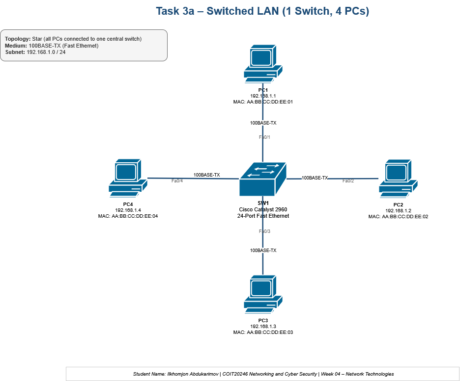
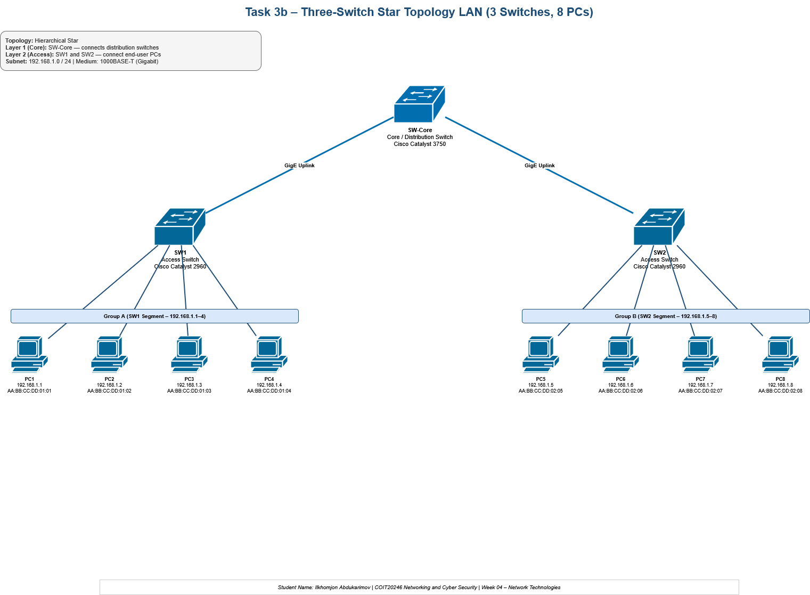
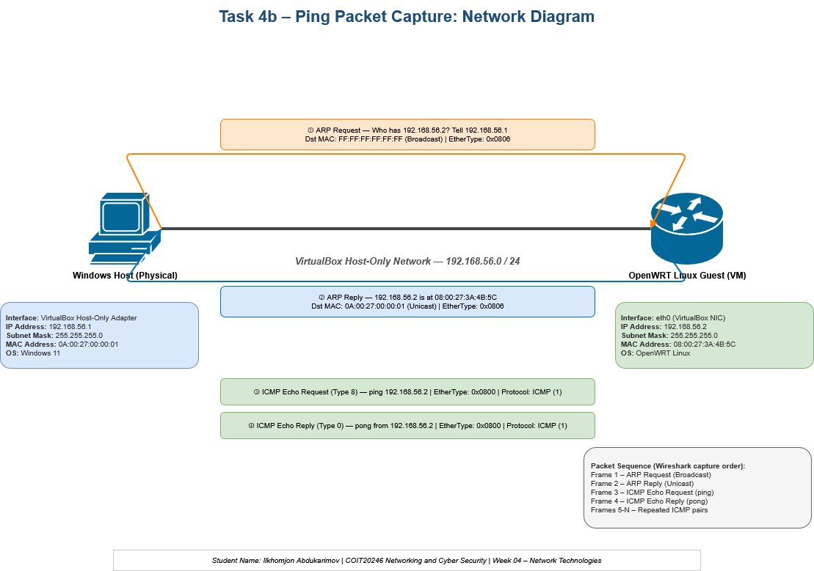
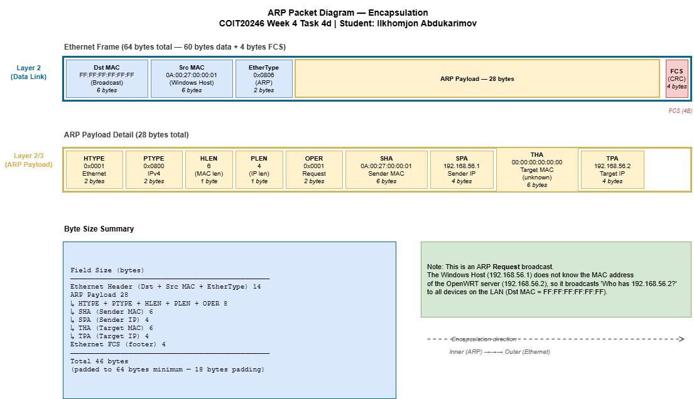
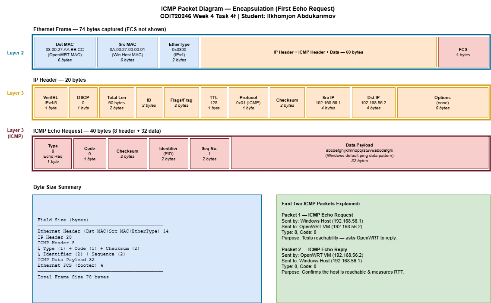
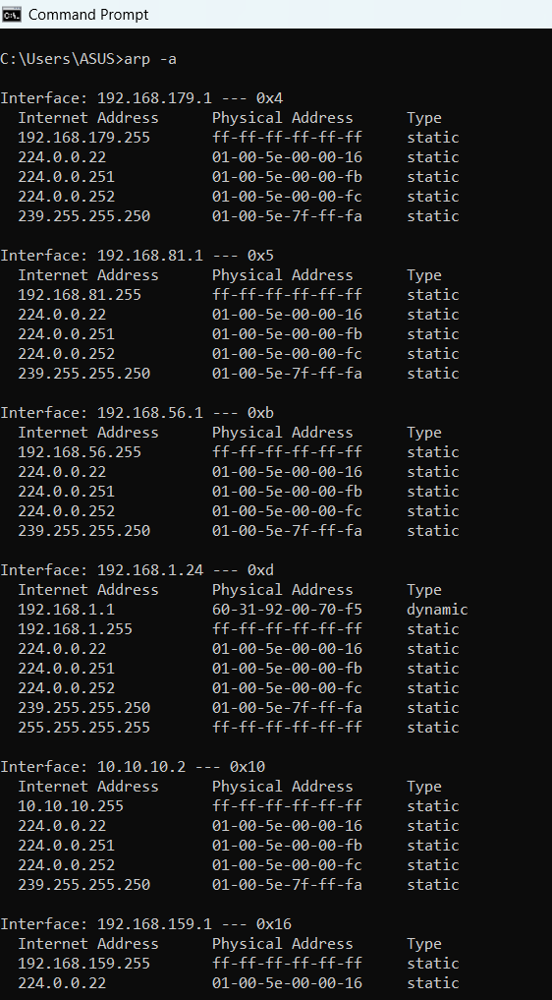

# Week 4 | Network Technologies

Student Name: Ilkhomjon Abdukarimov  
Student ID: 12326456  
Campus: Melbourne

---

## Task 1. Complete the Knowledge Test for Week 4

The following screenshot shows my Week 4 Knowledge Test score:


> **Note:** Add the actual Knowledge Test screenshot before final submission.

---

## Task 2. Project Initiation

The project group was formed for the COIT20246 networking project. The group will use GitHub to maintain the project plan, documentation, network design files and supporting evidence.

| Item | Details |
|---|---|
| Group member(s) | Ilkhomjon Abdukarimov |
| Project GitHub repository | **Add your project repository URL here** |
| Communication method | Moodle messages, GitHub issues and scheduled group discussion |
| Communication frequency | At least once per week, with extra communication before assessment deadlines |
| Project planning file | `plan.md` in the project repository |

---

## Task 3. Draw Network Diagrams

### Task 3a – Switched LAN with One Switch and Four PCs



Original diagrams.net file: [`week4-task3-lana.drawio`](./images/week4-task3-lana.drawio)

### Task 3b – Three-Switch Star Topology LAN



Original diagrams.net file: [`week4-task3-lanb.drawio`](./images/week4-task3-lanb.drawio)

---

## Task 4. Analyse Ping Packet Capture

The ping packet capture was analysed from a protocol and layering perspective. The capture involved communication between the Windows host and the OpenWRT Linux guest on the VirtualBox host-only network.

### Task 4b – Network Diagram



Original diagrams.net file: [`week4-task4-ping.drawio`](./images/week4-task4-ping.drawio)

### Task 4c – Purpose of ARP Packets

Address Resolution Protocol (ARP) is used on an IPv4 local area network to discover the MAC address that belongs to a known IPv4 address. In this packet capture, the Windows host knows the OpenWRT server IP address `192.168.56.2`, but it cannot send an Ethernet frame until it knows the OpenWRT server’s MAC address. Therefore, the Windows host sends an ARP Request as a broadcast frame using destination MAC address `FF:FF:FF:FF:FF:FF`. The request asks, “Who has `192.168.56.2`?” The OpenWRT server replies directly to the Windows host with its MAC address. After this ARP exchange, the Windows host can encapsulate ICMP packets inside Ethernet frames addressed to the OpenWRT MAC address.

### Task 4d – First ARP Packet Diagram



Original diagrams.net file: [`week4-task4-arp-packet.drawio`](./images/week4-task4-arp-packet.drawio)

### Task 4e – First Two ICMP Packets Explained

The first ICMP packet is an **Echo Request** sent from the Windows host `192.168.56.1` to the OpenWRT Linux guest `192.168.56.2`. Its purpose is to test whether the OpenWRT server is reachable. The ICMP Type is `8` and the Code is `0`, which identifies it as a standard ping request. The packet is carried inside an IPv4 packet and then inside an Ethernet frame.

The second ICMP packet is an **Echo Reply** sent from the OpenWRT Linux guest `192.168.56.2` back to the Windows host `192.168.56.1`. Its purpose is to confirm that the destination is reachable and allow the Windows host to calculate round-trip delay. The ICMP Type is `0` and the Code is `0`, which identifies it as a ping response.

### Task 4f – First ICMP Packet Diagram



Original diagrams.net file: [`week4-task4-icmp-packet.drawio`](./images/week4-task4-icmp-packet.drawio)

---

## Task 5. View ARP Table *(Optional)*

The ARP table was viewed using the following Windows command:

```powershell
arp -a
```



The output shows several interfaces and ARP entries. Most entries such as `224.0.0.22`, `224.0.0.251`, `224.0.0.252`, and `255.255.255.255` are static multicast or broadcast entries rather than ordinary reachable computers. The most useful dynamic entry shown is `192.168.1.1` with MAC address `60-31-92-00-70-f5`, which is likely the local router/default gateway because it is on the same physical LAN as the host interface `192.168.1.24`.

Because the screenshot mainly shows static multicast/broadcast entries and only one clear dynamic device, I would need to ping or communicate with another LAN device before submission if I wanted to fully satisfy the optional requirement of listing two reachable devices.
