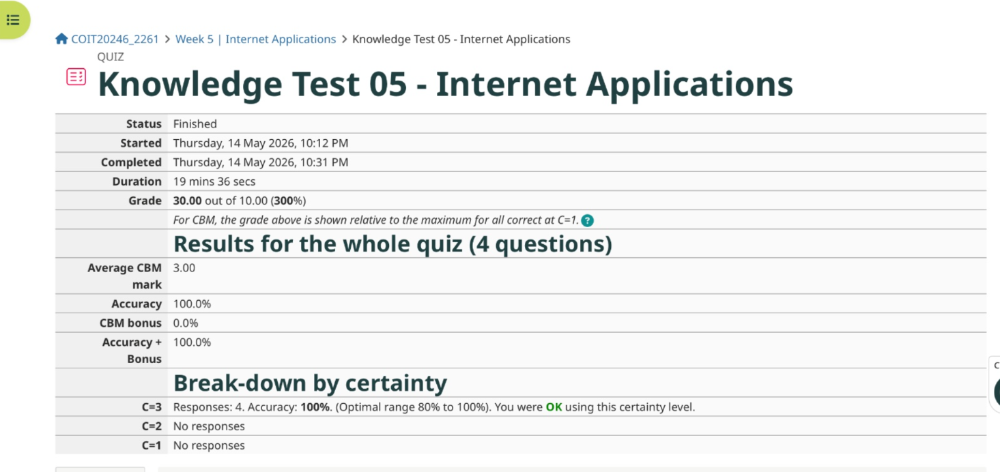
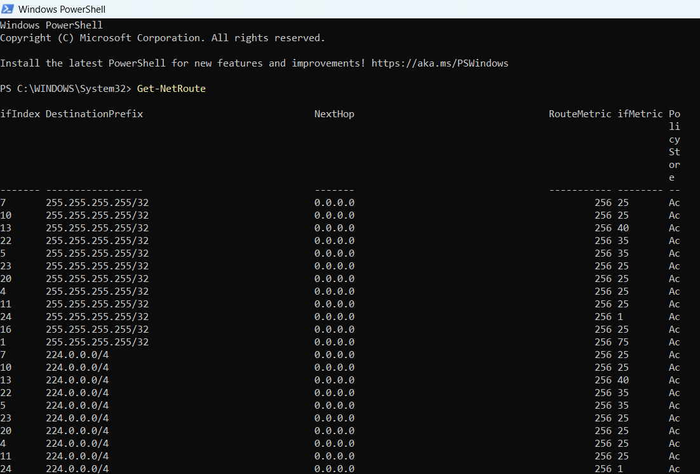
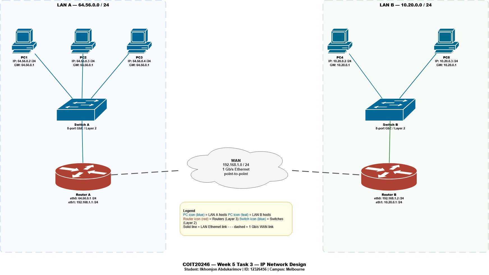
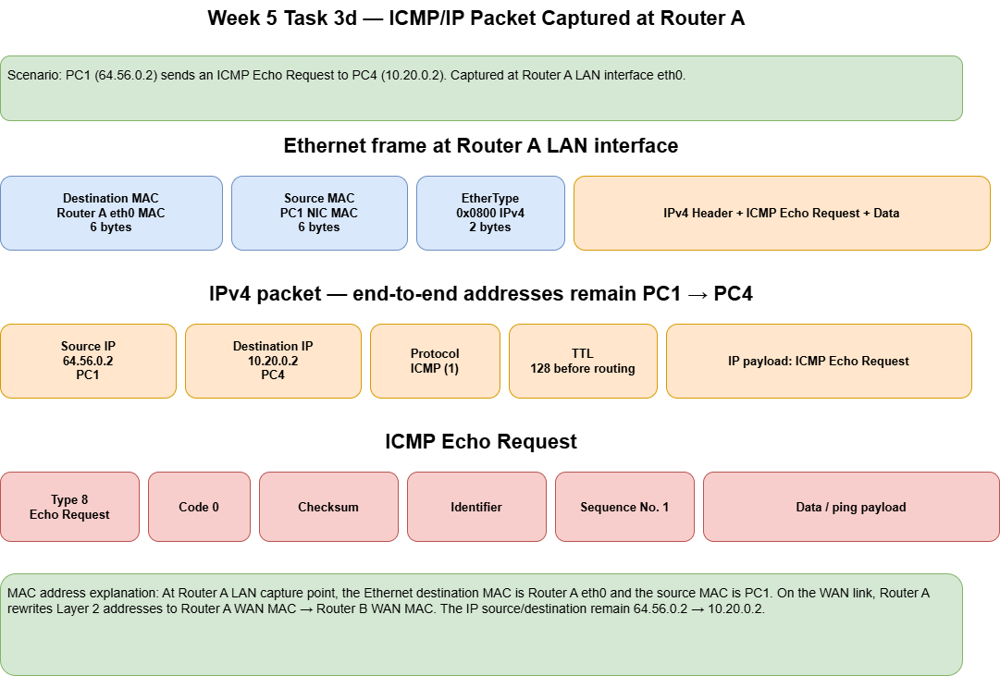
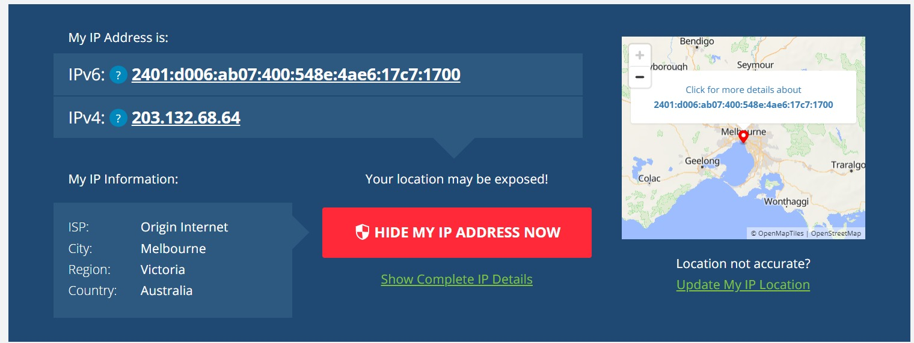
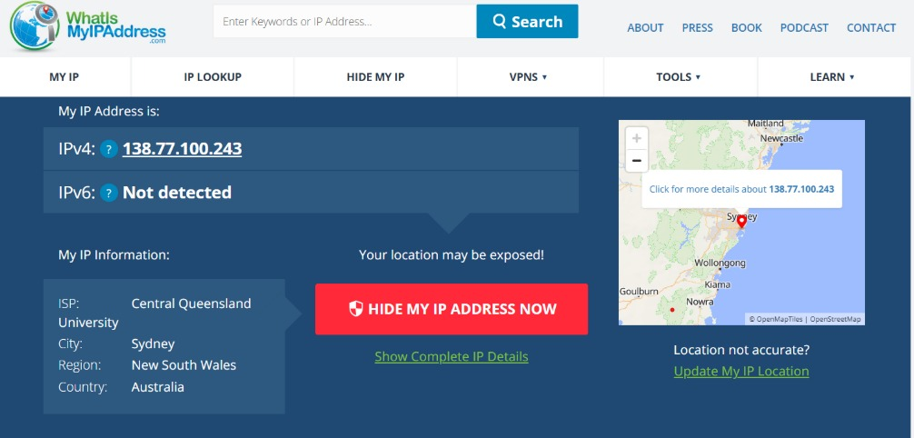

# Week 5 | Internetworking

Student Name: Ilkhomjon Abdukarimov  
Student ID: 12326456  
Campus: Melbourne

---

## Task 1. Complete the Knowledge Test for Week 5

The following screenshot shows my Week 5 Knowledge Test score:




---

## Task 2. View Routing Table

The routing table was viewed in Windows PowerShell using the following command:

```powershell
Get-NetRoute
```



### Routing Table Interpretation

A routing table tells the computer where to send packets. The most important columns in the PowerShell output are `DestinationPrefix`, `NextHop`, `RouteMetric`, `ifMetric`, and `PolicyStore`.

| Routing Table Element | Meaning |
|---|---|
| `DestinationPrefix` | The destination network or host address that the route applies to. For example, `/32` refers to one specific host address, while `/24` refers to a local subnet. |
| `NextHop` | The next router or gateway used to reach the destination. A value of `0.0.0.0` means the destination is directly reachable on the local interface. |
| `RouteMetric` | A cost value used by Windows to choose between multiple possible routes. A lower metric is preferred. |
| `ifMetric` | The interface metric. It helps Windows decide which network adapter is preferable when multiple adapters are available. |
| `PolicyStore` | Shows whether the route is currently active or stored persistently. Active routes are used by the operating system at that time. |

| Observed Route Type | Simple Explanation |
|---|---|
| `255.255.255.255/32` | Limited broadcast route used to send broadcast traffic on a local interface. It does not use an external next hop. |
| `224.0.0.0/4` | IPv4 multicast route used for multicast communication, such as discovery and local network service traffic. |
| Directly connected local subnet routes | Routes where the `NextHop` is `0.0.0.0`; traffic is sent directly through the relevant local network adapter. |
| Default route `0.0.0.0/0` *(if shown further down the output)* | Route used when no more specific destination route exists. It normally points to the default gateway/router. |

The screenshot contains many repeated broadcast and multicast rows because the computer has multiple active or virtual network interfaces. Each interface can have its own broadcast and multicast routes.

---

## Task 3. IP Network Design

### Team Member(s)

| Name | Student ID |
|---|---|
| Ilkhomjon Abdukarimov | 12326456 |
| VamsiMuooalla | 12322560 |


### Network Addressing Plan

The design uses three `/24` IPv4 networks. LAN A uses the last four digits of the student ID `6456`, giving the first two decimal values `64.56`. LAN B uses `10.20.0.0/24` as the partner/second LAN network. The WAN uses `192.168.1.0/24`.

| Network Segment | Network Address | Subnet Mask | Purpose |
|---|---|---|---|
| LAN A | `64.56.0.0/24` | `255.255.255.0` | Switched LAN with three PCs |
| WAN | `192.168.1.0/24` | `255.255.255.0` | 1 Gb/s point-to-point Ethernet link between routers |
| LAN B | `10.20.0.0/24` | `255.255.255.0` | Switched LAN with two PCs |

### Device and Interface Address Table

| Device | Interface | IP Address / Mask | Default Gateway | Notes |
|---|---|---|---|---|
| PC1 | NIC | `64.56.0.2/24` | `64.56.0.1` | LAN A host |
| PC2 | NIC | `64.56.0.3/24` | `64.56.0.1` | LAN A host |
| PC3 | NIC | `64.56.0.4/24` | `64.56.0.1` | LAN A host |
| Switch A | Layer 2 ports | No IP required | N/A | 8-port Gigabit Ethernet switch |
| Router A | eth0 | `64.56.0.1/24` | N/A | LAN A gateway |
| Router A | eth1 | `192.168.1.1/24` | N/A | WAN interface |
| Router B | eth0 | `192.168.1.2/24` | N/A | WAN interface |
| Router B | eth1 | `10.20.0.1/24` | N/A | LAN B gateway |
| Switch B | Layer 2 ports | No IP required | N/A | 8-port Gigabit Ethernet switch |
| PC4 | NIC | `10.20.0.2/24` | `10.20.0.1` | LAN B host |
| PC5 | NIC | `10.20.0.3/24` | `10.20.0.1` | LAN B host |

### Network Diagram



Original diagrams.net file: [`week5-task3-networkdiagram.drawio`](./images/week5-task3-networkdiagram.drawio)

### Simplified Routing Tables

#### PC1, PC2 and PC3 Routing Table

| Destination Network | Next Hop | Interface | Explanation |
|---|---|---|---|
| `64.56.0.0/24` | Direct | NIC | Traffic to LAN A stays on the local switched LAN. |
| `0.0.0.0/0` | `64.56.0.1` | NIC | All non-local traffic is sent to Router A. |

#### PC4 and PC5 Routing Table

| Destination Network | Next Hop | Interface | Explanation |
|---|---|---|---|
| `10.20.0.0/24` | Direct | NIC | Traffic to LAN B stays on the local switched LAN. |
| `0.0.0.0/0` | `10.20.0.1` | NIC | All non-local traffic is sent to Router B. |

#### Router A Routing Table

| Destination Network | Next Hop | Interface | Explanation |
|---|---|---|---|
| `64.56.0.0/24` | Direct | eth0 | Directly connected LAN A network. |
| `192.168.1.0/24` | Direct | eth1 | Directly connected WAN network. |
| `10.20.0.0/24` | `192.168.1.2` | eth1 | Remote LAN B reached through Router B. |

#### Router B Routing Table

| Destination Network | Next Hop | Interface | Explanation |
|---|---|---|---|
| `10.20.0.0/24` | Direct | eth1 | Directly connected LAN B network. |
| `192.168.1.0/24` | Direct | eth0 | Directly connected WAN network. |
| `64.56.0.0/24` | `192.168.1.1` | eth0 | Remote LAN A reached through Router A. |

#### Switch A and Switch B

Switch A and Switch B are Layer 2 switches, so they do not require IP routing tables for this design. They forward Ethernet frames based on MAC address learning.

### Task 3d – ICMP/IP Packet Captured at Router A



Original diagrams.net file: [`week5-task3-packet.drawio`](./images/week5-task3-packet.drawio)

If PC1 sends a ping request to PC4 and the packet is captured at Router A on the LAN A interface, the IP source address is `64.56.0.2` and the IP destination address is `10.20.0.2`. These Layer 3 addresses identify the original sender and final receiver, so they stay the same across the internetwork. However, the Layer 2 Ethernet MAC addresses only apply to the current link. At the Router A LAN interface, the Ethernet source MAC is PC1’s NIC MAC and the Ethernet destination MAC is Router A’s LAN interface MAC. When Router A forwards the packet across the WAN, it rewrites the frame so the source MAC becomes Router A’s WAN interface MAC and the destination MAC becomes Router B’s WAN interface MAC.

---

## Task 4. Academic Integrity Outcomes

### Selected Scenario

The selected scenario is a student submitting an assessment that contains copied material from another student or an online source without proper acknowledgement. This scenario is important because it can occur even when a student is under time pressure and believes that copying only a small section will not matter.

### What the Student Could Have Done Differently

The student should have started the assessment earlier, used their own wording, referenced all external sources, and asked the tutor for clarification before submission. If they were struggling, they should have requested academic support instead of copying work. They could also have used similarity-checking and careful note-taking to separate their own ideas from source material.

### Breach Level and Likely Outcome

This behaviour is likely to be treated as an academic integrity breach. Depending on the extent and intent, it may fall within a minor or moderate academic misconduct category. A likely outcome may include academic integrity education, a formal warning, a mark penalty, or a requirement to resubmit. The final decision would depend on the official university process and the evidence considered.

### Fairness Discussion

The outcome is fair to the student if the process considers intent, extent, previous history and whether the student had been properly informed about referencing. It is also fair to other students because academic misconduct weakens the value of honest work and creates unfair advantage. A clear penalty encourages all students to follow proper academic standards.

### Future Ramifications

If misconduct is not detected during the term, it can still create future risks. The student may progress without the required knowledge, perform poorly in later assessments or workplace tasks, and damage trust if the issue is discovered later. It can also affect other students by reducing confidence in the fairness of marks and qualifications.

### Two Recommendations

1. **Plan and reference early:** Begin assessments early, keep a source list from the start, and clearly reference any external ideas, diagrams, definitions or technical explanations.
2. **Ask for support before submitting:** If confused or behind schedule, contact the tutor, library, academic learning centre or group members instead of copying or submitting unverified work.

---

## Task 5. IP Address Lookup

Two IP lookup tests were performed using `whatismyipaddress.com`: one through a home Internet connection and one through the campus/CQU network.

### Home Network Result



| Field | Value Shown |
|---|---|
| IPv4 | `203.132.68.64` |
| IPv6 | `2401:d006:ab07:400:548e:4ae6:17c7:1700` |
| ISP | Origin Internet |
| City | Melbourne |
| Region | Victoria |
| Country | Australia |

### Campus Network Result



| Field | Value Shown |
|---|---|
| IPv4 | `138.77.100.243` |
| IPv6 | Not detected |
| ISP / Organisation | Central Queensland University |
| City | Sydney |
| Region | New South Wales |
| Country | Australia |

### Accuracy Discussion

The home lookup identified the ISP as Origin Internet and placed the connection in Melbourne, Victoria. This is reasonably accurate at the city or regional level, but it does not identify the exact home address or the local private IP address of the computer. The IP shown is the public address assigned by the ISP, not the private address used inside the home network.

The campus lookup identified the network as Central Queensland University, which is accurate for the organisation. However, the location was shown as Sydney, New South Wales, even though the user is associated with the Melbourne campus. This demonstrates that IP geolocation often identifies the registered network, routing point, or ISP infrastructure location rather than the exact physical location of the user.

Overall, IP address lookup provides approximate public network information such as ISP, organisation, city, region and country. It does not reliably reveal the exact physical location of the user or the private IP address of the computer.
