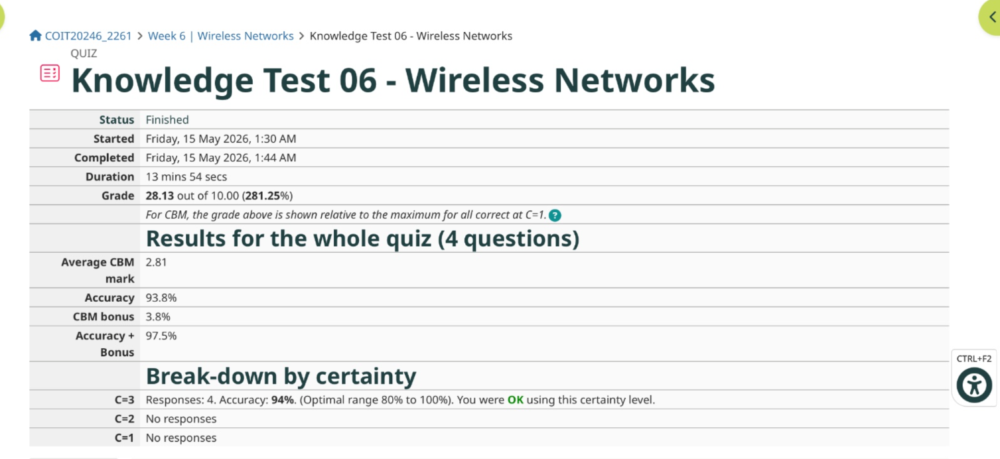
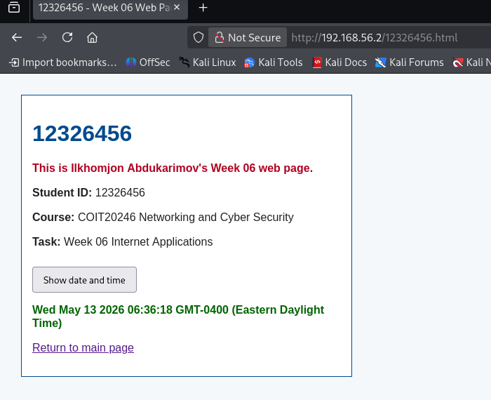
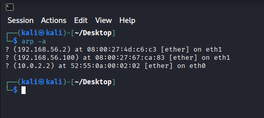
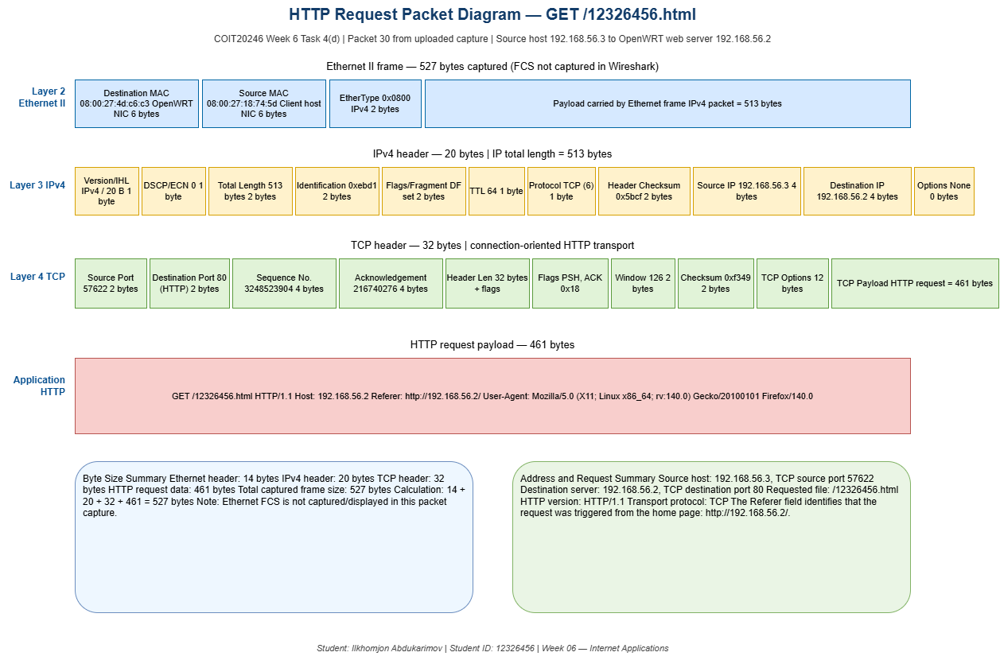

# Week 6 | Internet Applications

Student Name: Ilkhomjon Abdukarimov  
Student ID: 12326456  
Campus: Melbourne

---

## Task 1. Complete the Knowledge Test

The following screenshot shows my Week 6 Knowledge Test completion result:



---

## Task 2. Create Web Pages in OpenWRT

The OpenWRT web server was accessed at:

`http://192.168.56.2/`

The web server files were edited in the OpenWRT web directory. The required files created or edited for this task are included in this journal:

- `index.html`
- `12326456.html`
- `mystyle.css`

The `index.html` page includes a link to my student web page, `12326456.html`. The student web page displays my name, student ID, course details and a JavaScript button that displays the current date and time. The external CSS file `mystyle.css` changes the page formatting and text colours.

The following screenshot shows my web page after the **Show date and time** button was pressed:



---

## Task 3. Capture HTTP Packets

The HTTP packet capture was completed from the OpenWRT Linux server using `tcpdump`. The command used was:

```bash
cd
tcpdump -i eth0 -n -w week6-http-12326456.pcapng 'not tcp port 22'
```

After the capture started, I opened a browser, visited the OpenWRT web server, clicked the link to my student web page and pressed the **Show date and time** button. The packet capture file is included in this journal as:

`week6-http-12326456.pcapng`

The following screenshot shows the ARP table from the Kali/Windows host after communication with the OpenWRT web server:



The ARP table showed the OpenWRT web server address `192.168.56.2` mapped to MAC address `08:00:27:4d:c6:c3` on interface `eth1`. It also showed other reachable local/network entries, including `192.168.56.100` and `10.0.2.2`. This confirms that the host could resolve local IP addresses to Ethernet MAC addresses before sending frames on the local network.

---

## Task 4. Analyse HTTP Packet Capture

The capture file `week6-http-12326456.pcapng` was opened in Wireshark. The `http` display filter was applied first to focus on HTTP requests and responses.

### a) HTTP Requests and Responses

| Packet(s) | Request / Response | Explanation |
|---|---|---|
| 4 and 6 | `GET / HTTP/1.1` → `HTTP/1.1 304 Not Modified` | The browser requested the OpenWRT home page. The server responded with `304 Not Modified`, meaning the browser already had a cached copy and did not need to download the full page again. |
| 14 and 15 | `GET /mystyle.css HTTP/1.1` → `HTTP/1.1 304 Not Modified` | The browser requested the external CSS stylesheet used by the web page. The server again returned `304 Not Modified`, showing that the cached stylesheet was still valid. |
| 21 and 23 | `GET /favicon.ico HTTP/1.1` → `HTTP/1.1 404 Not Found` | The browser automatically requested a website icon file. The OpenWRT web server did not have `favicon.ico`, so it returned `404 Not Found`. |
| 30 and 32 | `GET /12326456.html HTTP/1.1` → `HTTP/1.1 304 Not Modified` | This request was triggered when the link to my student web page was opened. The server responded that the cached version of `12326456.html` was still current. |
| 52 and 53 | `GET /index.html HTTP/1.1` → `HTTP/1.1 200 OK` | This request occurred when the browser returned to the main page. The server returned `200 OK`, meaning the request was successful and the page content was available. |

### b) Five Address Values for the First HTTP Request/Response

For the first HTTP request, the following address values identify the host, transport and application layers:

| Address Type | Value | Meaning |
|---|---|---|
| Source IP address | `192.168.56.3` | The client/host that sent the HTTP request. |
| Destination IP address | `192.168.56.2` | The OpenWRT web server receiving the request. |
| Source TCP port | `50030` | Temporary client-side port used for the HTTP connection. |
| Destination TCP port | `80` | Standard HTTP server port. |
| HTTP Host header | `192.168.56.2` | The application-layer host requested by the browser. |

The Ethernet addresses visible in the capture were also important for local delivery: the client MAC was `08:00:27:18:74:5d` and the OpenWRT server MAC was `08:00:27:4d:c6:c3`.

### c) Date and Time Button

When I clicked the **Show date and time** button, the browser did not send a new HTTP request to the OpenWRT web server. This is because the button uses JavaScript that was already loaded in the HTML page. The date and time are generated locally by the browser using the `new Date()` function, so no extra file or server-side data is required.

### d) HTTP Request Packet Diagram

The following packet diagram represents the HTTP request for my newly created student page:



The original Draw.io source file is included as:

`week6-task4-http-packet.drawio`

For the request packet shown in the diagram:

| Layer | Header / Data | Size / Value |
|---|---|---|
| Layer 2 | Ethernet II header | 14 bytes |
| Layer 3 | IPv4 header | 20 bytes |
| Layer 4 | TCP header | 32 bytes |
| Application | HTTP request payload | 461 bytes |
| Captured frame size | Ethernet + IP + TCP + HTTP | 527 bytes captured |
| Source MAC | Client host | `08:00:27:18:74:5d` |
| Destination MAC | OpenWRT server | `08:00:27:4d:c6:c3` |
| Source IP | Client host | `192.168.56.3` |
| Destination IP | OpenWRT server | `192.168.56.2` |
| Source TCP port | Client port | `57622` |
| Destination TCP port | HTTP port | `80` |
| HTTP request | Requested file | `GET /12326456.html HTTP/1.1` |

### e) Referrer Value

For the HTTP request to `12326456.html`, the referrer value was:

`http://192.168.56.2/`

The referrer identifies the web page that led the browser to the current request. In this case, it shows that the student page was opened from the OpenWRT home page. Web servers can use referrer information for traffic analysis, user navigation analysis, troubleshooting broken links and understanding which pages send users to a requested resource.

### f) Browser Information Learned by the Server

The server learned browser and platform information from the `User-Agent` header. The captured User-Agent value was:

`Mozilla/5.0 (X11; Linux x86_64; rv:140.0) Gecko/20100101 Firefox/140.0`

This tells the server that the request came from Firefox version 140.0 running on a Linux x86_64 system. Such information can help web servers adjust content for browser compatibility, but it may also reveal details about the user environment.

### g) HTTP Version and Transport Protocol

The captured traffic used:

- HTTP version: `HTTP/1.1`
- Transport protocol: `TCP`

This is shown by the HTTP request line `GET /12326456.html HTTP/1.1` and by the TCP connection between client port `57622` and server port `80`.

### h) TCP Connection Setup

For the connection that carried the request for `12326456.html`, the TCP three-way handshake was:

| Packet | Direction | TCP Flag | Explanation |
|---|---|---|---|
| 27 | `192.168.56.3 → 192.168.56.2` | SYN | Client requested a new TCP connection to the OpenWRT web server. |
| 28 | `192.168.56.2 → 192.168.56.3` | SYN, ACK | Server acknowledged the SYN and agreed to establish the connection. |
| 29 | `192.168.56.3 → 192.168.56.2` | ACK | Client acknowledged the server response and completed the handshake. |
| 30 | `192.168.56.3 → 192.168.56.2` | PSH, ACK | The browser sent the HTTP request for `/12326456.html`. |

The time from the start of connection setup at packet 27 to the HTTP request at packet 30 was approximately `0.009654` seconds. This indicates a very fast connection setup because the client and OpenWRT server were communicating on a local VirtualBox network.

The first HTTP request in the capture also used a three-way handshake: packet 1 was SYN, packet 2 was SYN/ACK, packet 3 was ACK and packet 4 contained the first HTTP GET request. The time between packet 1 and packet 4 was approximately `0.046366` seconds.

### i) Acknowledgements

TCP acknowledgements were visible throughout the capture. For example, packet 29 acknowledged the server's SYN/ACK during the connection setup, and packet 31 acknowledged receipt of the HTTP request segment for `/12326456.html`. Other ACK packets, such as packets 33, 35, 37, 39 and 41, acknowledged later data segments from the server.

An acknowledgement is typically sent after a host receives TCP data or a TCP control segment. It confirms that bytes were received successfully and tells the sender the next byte expected. This reliability mechanism is one of the main reasons HTTP/1.1 over TCP can deliver web data in order and retransmit lost data if necessary.

---

## Task 5. View Your Cookies

I used the browser developer tools to inspect cookies from a regularly visited website. The cookies stored several types of information about the browser session, including session identifiers, user preferences, language or region settings, analytics identifiers and security-related values.

I did not include the exact cookie values in this journal because cookie values can reveal private session information. The cookies did not store a readable password, but some cookie values acted as unique identifiers that allowed the website to recognise the browser during later visits. Essential cookies supported basic website functions, while other cookies supported analytics, personalisation or tracking. This shows that cookies improve usability but can also create privacy risks if they are exposed or misused.
