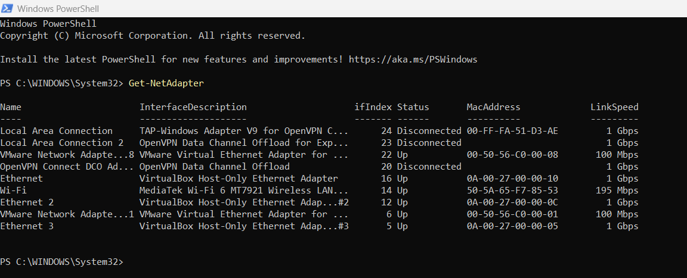
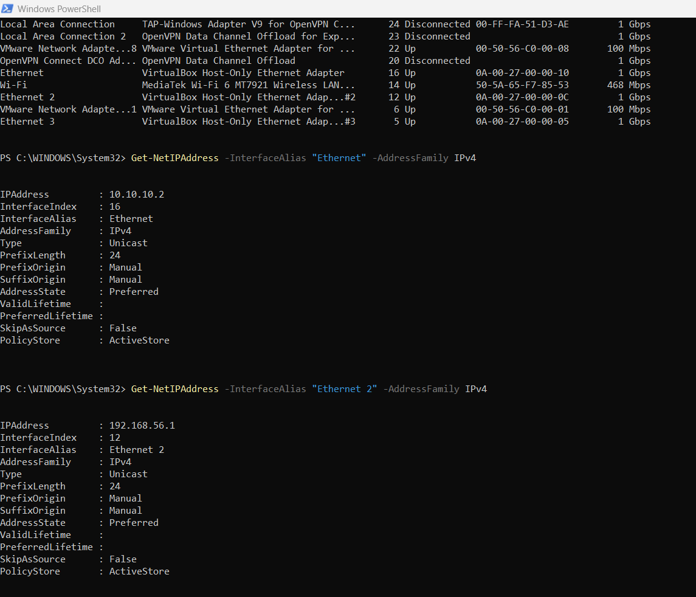
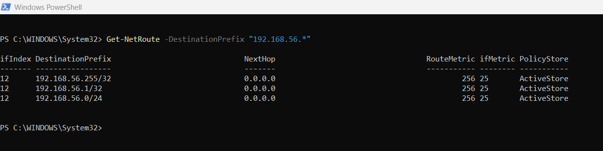
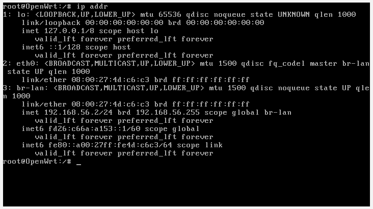
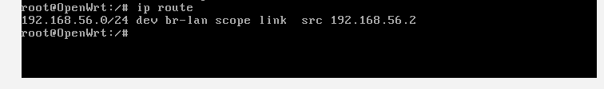
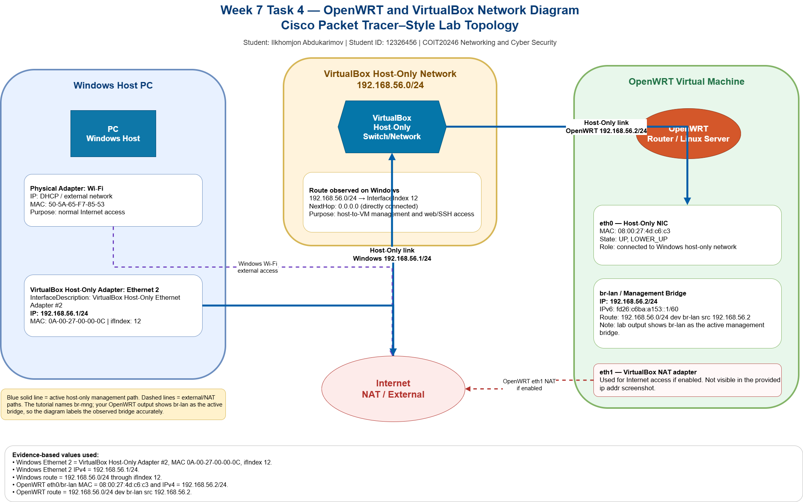
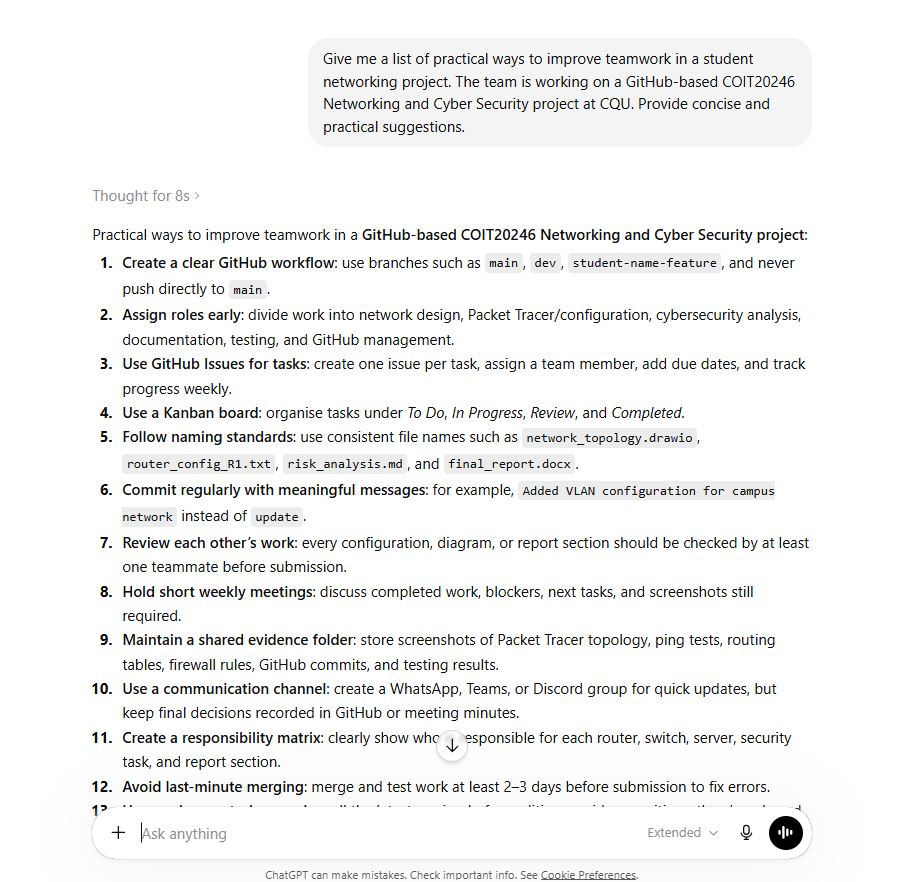

# Week 7 | OpenWRT Networking

**Student Name:** Ilkhomjon Abdukarimov  
**Student ID:** 12326456  
**Campus:** Melbourne  
**Unit:** COIT20246 Networking and Cyber Security  
**Tutorial Topic:** OpenWRT Networking  

---

## Task 1. Complete the Knowledge Test

The following screenshot shows my Week 7 Knowledge Test completion evidence.


---

## Task 2. Review the Slides on OpenWRT and VirtualBox

The Week 7 slides on **Networking in OpenWRT and VirtualBox** were reviewed. No journal entry is required for this task because the tutorial instructions state that this task does not require a journal submission item.

---

## Task 3. Collecting Network Information

This task was completed by collecting network information from both the Windows host machine and the OpenWRT virtual machine. The purpose of this task was to understand how VirtualBox host-only networking allows the Windows host to communicate with OpenWRT and how OpenWRT identifies its active interfaces and routes.

### 3.1 Windows Host Network Information

The Windows host network adapters were listed using PowerShell with the command:

```powershell
Get-NetAdapter
```



The IPv4 addresses for the VirtualBox host-only adapters were checked using:

```powershell
Get-NetIPAddress -InterfaceAlias "Ethernet" -AddressFamily IPv4
Get-NetIPAddress -InterfaceAlias "Ethernet 2" -AddressFamily IPv4
```



The route used by Windows to reach the OpenWRT host-only network was checked using:

```powershell
Get-NetRoute -DestinationPrefix "192.168.56.*"
```



The key result is that **Ethernet 2** is the VirtualBox host-only adapter used for the OpenWRT lab network. It has the IPv4 address **192.168.56.1/24**, and the Windows routing table confirms that traffic for **192.168.56.0/24** is sent through interface index **12**.

### 3.2 OpenWRT Guest Network Information

The OpenWRT interface information was collected using:

```bash
ip addr
```



The OpenWRT routing table was checked using:

```bash
ip route
```



The OpenWRT output shows that **eth0** is connected to the management bridge and that **br-lan** has the IPv4 address **192.168.56.2/24**. The routing table confirms that the **192.168.56.0/24** network is directly connected through **br-lan**.

### 3.3 Collected Network Information Table

| Device | Interface | IP Address | VirtualBox Adapter Type | Purpose |
|---|---|---|---|---|
| Windows Host | Wi-Fi | DHCP-assigned external network address | Physical network adapter | Provides normal host internet access outside the OpenWRT lab network. |
| Windows Host | Ethernet | 10.10.10.2/24 | VirtualBox Host-Only Ethernet Adapter | Additional host-only adapter present on the Windows host; not the active 192.168.56.0/24 OpenWRT management network. |
| Windows Host | Ethernet 2 | 192.168.56.1/24 | VirtualBox Host-Only Ethernet Adapter #2 | Main host-only adapter used to communicate with the OpenWRT VM at 192.168.56.2. |
| Windows Host | Ethernet 3 | No IPv4 value captured in this task | VirtualBox Host-Only Ethernet Adapter #3 | Additional host-only adapter available in VirtualBox but not used for the current OpenWRT management path. |
| OpenWRT VM | lo | 127.0.0.1/8 | Loopback interface | Internal OpenWRT loopback interface used for local system communication. |
| OpenWRT VM | eth0 | No separate IPv4 address; attached to bridge | VirtualBox Host-Only Adapter | Physical virtual NIC connected to the host-only network and linked to the bridge interface. |
| OpenWRT VM | br-lan | 192.168.56.2/24 | Management bridge over host-only adapter | Active OpenWRT management interface used for SSH, web access and host-to-VM communication. |
| OpenWRT VM | eth1 | Not visible in captured `ip addr` output | VirtualBox NAT Adapter if enabled | Intended NAT/internet interface for OpenWRT when a NAT adapter is enabled. |

### 3.4 Interpretation

The collected evidence shows that the Windows host and OpenWRT VM are on the same host-only subnet: **192.168.56.0/24**. The Windows host uses **192.168.56.1**, while OpenWRT uses **192.168.56.2**. Because both addresses are in the same /24 subnet, traffic between the Windows host and OpenWRT does not require an external router. Instead, VirtualBox provides the host-only virtual network path. The Windows route entry for **192.168.56.0/24** confirms that Windows forwards traffic for that subnet through interface index **12**, which corresponds to **Ethernet 2**.

The OpenWRT `ip addr` output shows that the active management address is assigned to **br-lan**, not directly to eth0. This is normal in OpenWRT because a bridge interface can group one or more lower-level interfaces and provide a single management IP address. Although the tutorial refers to **br-mng**, the actual lab output shows **br-lan** as the active management bridge, so the journal and diagram use the observed interface name accurately.

---

## Task 4. Draw Network Diagram

The following diagram shows the Week 7 OpenWRT and VirtualBox networking setup. It includes the Windows host, the host-only network, the OpenWRT VM, the active bridge interface, the NAT/internet path and the key IP/MAC values identified during Task 3.



The original editable Draw.io file is also included in this journal:

```text
week7-task4-networkdiagram.drawio
```

### Diagram Explanation

The diagram shows that the Windows host has multiple adapters, but **Ethernet 2** is the important adapter for this lab because it has the IP address **192.168.56.1/24**. This connects to the VirtualBox host-only network **192.168.56.0/24**. The OpenWRT VM is reachable on **192.168.56.2/24** through its bridge interface **br-lan**, which is connected to **eth0**. The solid blue path in the diagram represents the active host-only management path used for SSH, browser access and OpenWRT testing. The dashed paths represent external or NAT-style internet access paths, which are separate from the local OpenWRT management network.

---

## Task 5. Self-Evaluation of Teamwork

### 5.1 Generative AI Prompt and Output

The following screenshot shows the generative AI prompt and response used to identify practical ways to improve teamwork in a student networking project.



The AI response suggested several practical teamwork improvements, including creating a clear GitHub workflow, assigning roles early, using GitHub Issues, using a Kanban board, following consistent naming standards, committing regularly, reviewing each other’s work, holding short weekly meetings, maintaining a shared evidence folder and avoiding last-minute merging.

### 5.2 Comparison With Current Teamwork Practice

Our team has already followed some of these practices. For example, we have used GitHub as a shared location for project artefacts, which supports version control and makes it easier to keep diagrams, screenshots, configuration files and documentation in one location. We have also divided some activities between team members, especially where tasks involve different evidence types such as screenshots, network diagrams and written explanations.

However, the AI suggestions also show areas where our team can improve. The main improvement required is a more structured GitHub workflow. Instead of adding files informally, the team should use GitHub Issues or a shared task board to assign responsibilities clearly. For example, one member can be assigned to OpenWRT configuration evidence, another to diagrams, another to testing and another to final documentation review. This would reduce duplication and make individual accountability clearer.

Another improvement is commit quality. Team members should commit regularly using meaningful commit messages. A weak message such as `update` does not clearly explain what was changed. A stronger message would be `added Week 7 OpenWRT network diagram` or `updated routing table evidence`. This would make the GitHub history easier to understand for both the team and the marker.

### 5.3 GitHub Contributors Review

The following screenshot shows the GitHub Contributors page for the project repository.


The contributor view is useful because it provides visible evidence of who has contributed to the repository over time. Commit activity does not always measure the full quality of a person’s work, because one large technical contribution may require fewer commits than several small formatting changes. However, the contributors graph is still useful because it shows whether participation is reasonably balanced and whether work is being uploaded progressively rather than at the last minute.

### 5.4 Evaluation of My Contribution and Team Improvement Plan

My contribution has focused on preparing and organising technical evidence, including network configuration outputs, OpenWRT interface information, routing information and diagram evidence. This contribution is important because the project depends on accurate technical documentation, not only written explanation. Compared with other members, my visible GitHub contribution should be assessed not only by the number of commits but also by the relevance and completeness of the submitted evidence.

For the remainder of the project, the team should improve in four main ways. First, each member should commit their own assigned work so contribution is visible. Second, the team should agree on naming conventions for files, such as `week7-task4-networkdiagram.png`, to avoid confusion. Third, the team should review each other’s technical evidence before submission so that incorrect IP addresses, missing screenshots or unclear diagrams are corrected early. Fourth, the team should use short weekly progress checks to confirm what is complete, what is missing and who is responsible for the next task.

Overall, the self-evaluation shows that the team has made progress, but stronger coordination and clearer GitHub practices are needed to improve fairness, transparency and final submission quality.

---
