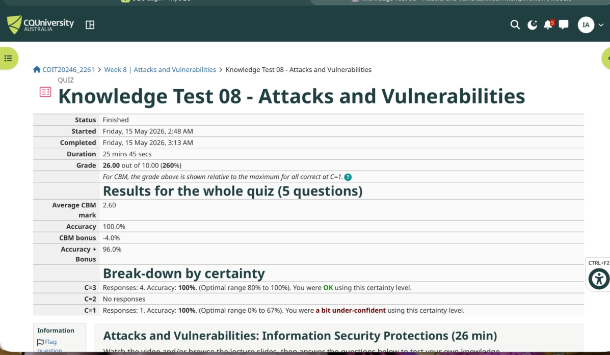
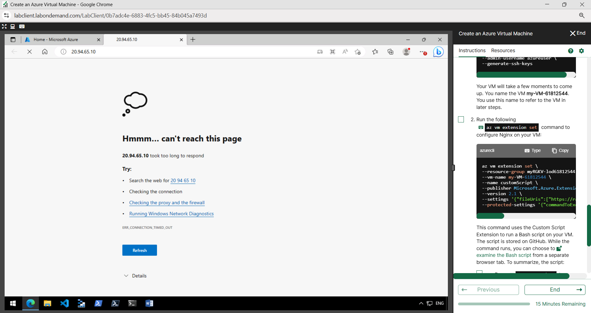
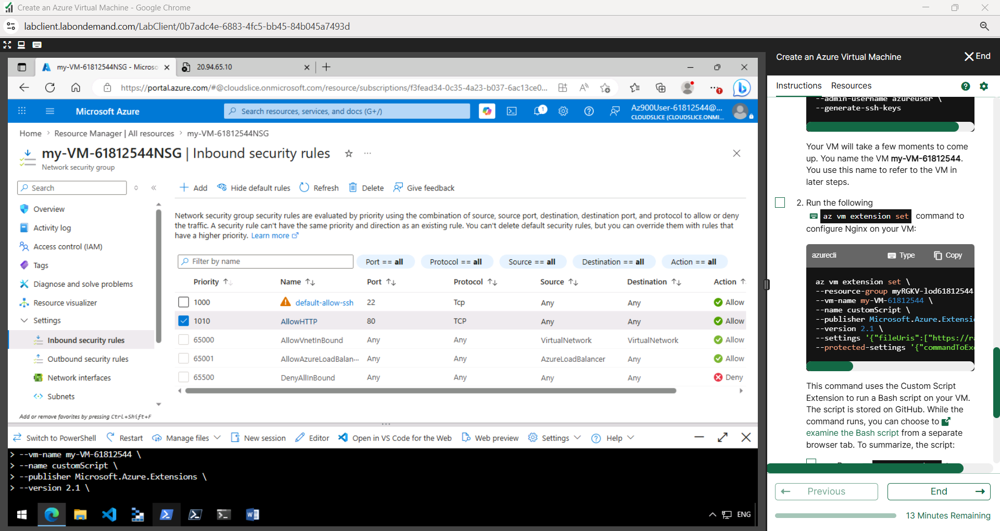
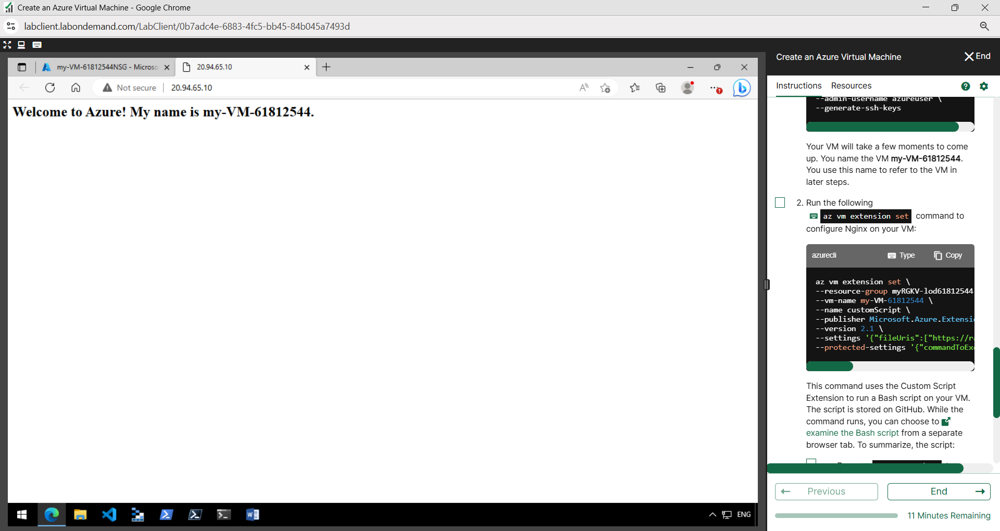
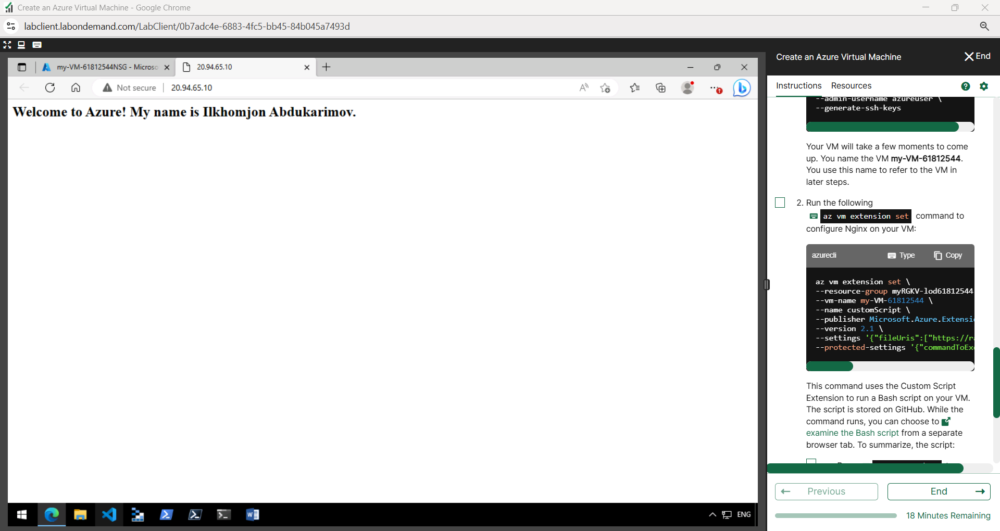
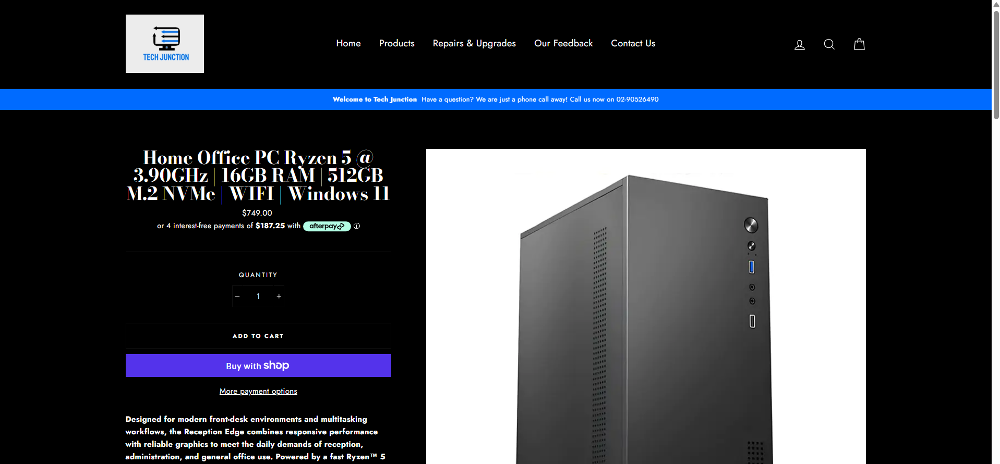
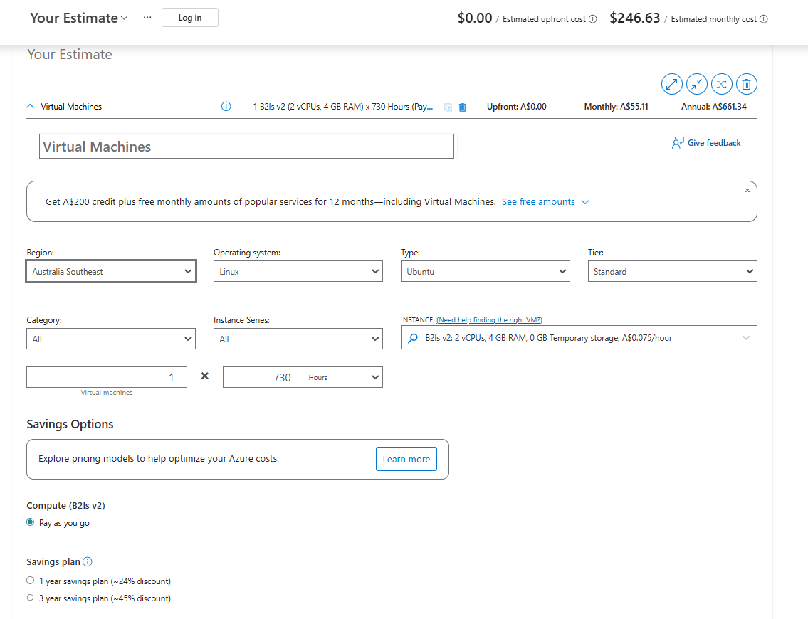
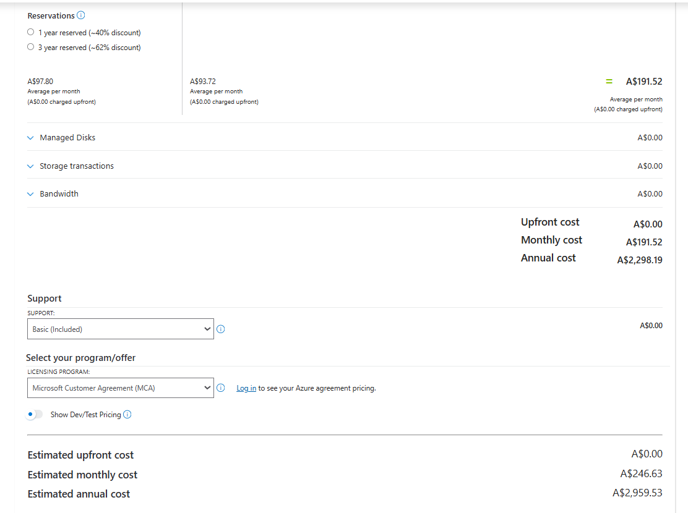

# Week 8 | Cloud Computing

**Student Name:** Ilkhomjon Abdukarimov  
**Student ID:** 12326456  
**Campus:** Melbourne  
**Unit:** COIT20246 Networking and Cyber Security  
**Tutorial Topic:** Cloud Computing  

---

## Task 1. Complete the Knowledge Test

The following screenshot shows my Week 8 Knowledge Test completion evidence.



---

## Task 2. Login to Microsoft Learn on Demand

I logged in to Microsoft Learn on Demand / Skillable using the temporary lab environment provided for the COIT20246 Azure activities. This is important because the Week 8 tutorial requires students to use the Microsoft Learn on Demand temporary Azure account rather than a personal Azure account or CQU Azure account.

After entering the COIT20246 class environment, I accessed the Microsoft Azure Fundamentals lab activities and completed the required cloud-computing tasks using the provided temporary Azure subscription.

---

## Task 3. Create an Azure Resource

I completed the Azure resource creation activity in Microsoft Learn on Demand. The lab created and used several Azure resources that work together to support the virtual-machine deployment and web access task.

| Azure Resource | Resource Name / Evidence | Purpose |
|---|---|---|
| Resource Group | `myRGKV-lod61812544` | A logical container used to organise all Azure resources created during the lab. It allows related resources to be managed together. |
| Virtual Machine | `my-VM-61812544` | The Ubuntu Linux server used to host the Nginx web page. |
| Network Security Group | `my-VM-61812544NSG` | Controls inbound and outbound network traffic to the virtual machine. It was used to allow SSH and HTTP traffic. |
| Public IP Address | `20.94.65.10` | Provides public internet access to the Azure VM so the website can be opened in a browser. |
| Network Interface | Created automatically with the VM | Connects the VM to the Azure virtual network and applies network security rules. |
| Virtual Network / Subnet | Created automatically by the lab | Provides private networking for the Azure VM inside the Azure environment. |
| Managed Disk | Created automatically with the VM | Stores the operating system and web-server files for the Ubuntu VM. |

The resource group is the main organisational unit, while the VM, public IP address, network interface, disk and NSG are the resources required to deploy, secure and access the web server.

---

## Task 4. Create an Azure Virtual Machine and Allow Web Access

### 4.1 Azure VM Creation and Nginx Installation Commands

The Azure VM was created using Azure CLI commands in the Microsoft Learn on Demand lab environment. The lab-generated VM name was `my-VM-61812544` and the public IP address used for testing was `20.94.65.10`.

The following Azure CLI commands represent the commands used to create the VM and install/configure Nginx during the lab:

```bash
az group create \
  --name myRGKV-lod61812544 \
  --location eastus
```

```bash
az vm create \
  --resource-group myRGKV-lod61812544 \
  --name my-VM-61812544 \
  --image Ubuntu2204 \
  --admin-username azureuser \
  --generate-ssh-keys
```

```bash
az vm extension set \
  --resource-group myRGKV-lod61812544 \
  --vm-name my-VM-61812544 \
  --name customScript \
  --publisher Microsoft.Azure.Extensions \
  --version 2.1 \
  --settings '{"commandToExecute":"sudo apt-get update && sudo apt-get install -y nginx"}'
```

The custom script extension installs and configures Nginx on the Ubuntu virtual machine. Nginx is the web server used to display the web page through the VM public IP address.

### 4.2 Public IP Address

| Item | Value |
|---|---|
| VM Name | `my-VM-61812544` |
| Public IP Address | `20.94.65.10` |
| Web URL Tested | `http://20.94.65.10` |

### 4.3 Website Before HTTP Access Was Allowed

Before the HTTP rule was added to the Network Security Group, the browser could not access the web server. The page returned a connection timeout because inbound HTTP traffic on TCP port 80 was not yet permitted by the NSG.



### 4.4 Network Security Group Rule Configuration

The Network Security Group initially allowed SSH access on TCP port 22. This is required so the VM can be managed remotely using SSH. However, the website was not accessible until an additional inbound security rule was added for HTTP on TCP port 80.

The following screenshot shows the inbound security rules after the HTTP rule was added.



| Rule Name | Port | Protocol | Action | Purpose |
|---|---:|---|---|---|
| `default-allow-ssh` | 22 | TCP | Allow | Allows secure remote login to the Ubuntu virtual machine using SSH. This is required for administration and editing server files. |
| `AllowHTTP` | 80 | TCP | Allow | Allows web browser access to the Nginx website hosted on the Ubuntu VM. Without this rule, public HTTP access times out. |

This confirms the security principle that cloud resources are not automatically accessible on every port. Access must be explicitly allowed through firewall or NSG rules.

### 4.5 Website After HTTP Rule Was Added

After the HTTP rule was added, the Nginx page became accessible through the public IP address. This confirmed that the VM was running correctly and that the NSG rule allowed inbound HTTP traffic.



### 4.6 Editing the Web Page Through SSH

I logged in to the Ubuntu VM using SSH and edited the Nginx default page.

```bash
ssh -l azureuser 20.94.65.10
```

If host-key verification errors occur, the following command can be used:

```bash
ssh -l azureuser 20.94.65.10 -o StrictHostKeyChecking=no
```

The web page was edited using:

```bash
sudo nano /var/www/html/index.html
```

The page was updated to include my name:

```html
Welcome to Azure! My name is Ilkhomjon Abdukarimov.
```

After refreshing the website, the updated page displayed my name successfully.



### 4.7 Task 4 Interpretation

This task demonstrates the relationship between compute, networking and security in Azure. Creating the VM alone was not enough to make the website accessible. Although Nginx was installed on the Ubuntu server, public access still depended on the Network Security Group rule allowing TCP port 80. This shows that cloud security follows an explicit access-control model: management traffic such as SSH and application traffic such as HTTP must be enabled intentionally and should be limited to the required ports only.

---

## Task 5. Compare Cloud vs On-Premise Costs

Task 5 compares an on-premise consumer desktop PC with an Azure cloud virtual machine. The comparison considers specifications, upfront cost, 1-year cost and 3-year cost. The purpose is to understand the financial difference between buying fixed physical hardware and using pay-as-you-go cloud computing.

### 5.1 Consumer Desktop PC Cost Evidence

The selected consumer PC is a **Home Office PC Ryzen 5 @ 3.90GHz | 16GB RAM | 512GB M.2 NVMe | WiFi | Windows 11** from Tech Junction. The listed price is **AUD $749.00**.



### 5.2 Azure VM Cost Evidence

The Azure Pricing Calculator was used to estimate the cost of an Ubuntu Linux virtual machine. The calculator settings shown in the screenshots include:

- Region: Australia Southeast
- Operating system: Linux
- Type: Ubuntu
- Tier: Standard
- VM instance: B2ls v2
- vCPU/RAM: 2 vCPU, 4 GB RAM
- Usage: 730 hours/month
- Pricing model: Pay-as-you-go
- Estimated monthly cost: AUD $246.63
- Estimated annual cost: AUD $2,959.53





### 5.3 Cost and Specification Comparison

| Option | CPU / vCPU | RAM | Storage | Cost Type | 1-Year Cost AUD | 3-Year Cost AUD | Notes |
|---|---|---:|---|---|---:|---:|---|
| Consumer Desktop PC | Ryzen 5 @ 3.90GHz | 16 GB | 512 GB M.2 NVMe SSD | Upfront purchase | $749.00 | $749.00 | One-time hardware purchase, excluding electricity, repairs, upgrades and depreciation. |
| Azure Virtual Machine | B2ls v2, 2 vCPU | 4 GB | Azure VM storage / temporary storage as configured in calculator | Pay-as-you-go monthly cloud cost | $2,959.53 | $8,878.59 | No upfront hardware purchase, but continuous monthly operating cost if left running. |

**Azure 3-year cost calculation:**

```text
$2,959.53 × 3 = $8,878.59
```

### 5.4 Cost Interpretation

The desktop PC is cheaper over both one year and three years if the workload is stable and the device is used continuously. Its main advantage is that the cost is paid once upfront. The user owns the hardware and can continue using it without a monthly compute charge. However, the desktop PC also has limitations. It requires physical space, electricity, maintenance and eventual replacement. It is also less flexible because increasing performance requires buying or upgrading hardware.

The Azure VM has a different cost model. It has no hardware purchase cost, but the monthly cost continues while the VM is provisioned and running. This is useful for temporary labs, short-term projects, rapid testing and scalable cloud workloads. The VM can be created quickly, accessed remotely and deleted when it is no longer required. However, if the VM is left running continuously for several years, the total cost becomes much higher than the consumer PC.

### 5.5 Trade-Off Discussion

The consumer desktop PC is most suitable when the workload is predictable, long-term and local. It provides stronger value when the user needs a permanent machine and does not require fast scaling or cloud availability. It also provides greater physical control over the hardware and storage. The disadvantage is that the user is responsible for maintenance, security, physical damage risk, backup and upgrades.

The Azure VM is more suitable when flexibility is more important than long-term ownership. It can be provisioned quickly, accessed from different locations and resized or deleted depending on demand. This is useful in education, software testing, temporary web hosting and development environments. It also supports cloud features such as security groups, public IP addressing, automated deployment and scalable resource management. The disadvantage is ongoing cost. If students or organisations forget to stop or delete unused VMs, costs can increase quickly.

Overall, the desktop PC is more cost-effective for long-term fixed use, while the Azure VM is more flexible for temporary, remote or scalable computing. In this Week 8 lab, Azure was useful because it allowed a complete web server to be deployed and accessed publicly in a short time without buying physical hardware. However, the cost comparison shows why cloud resources must be managed carefully and shut down when they are no longer needed.

---