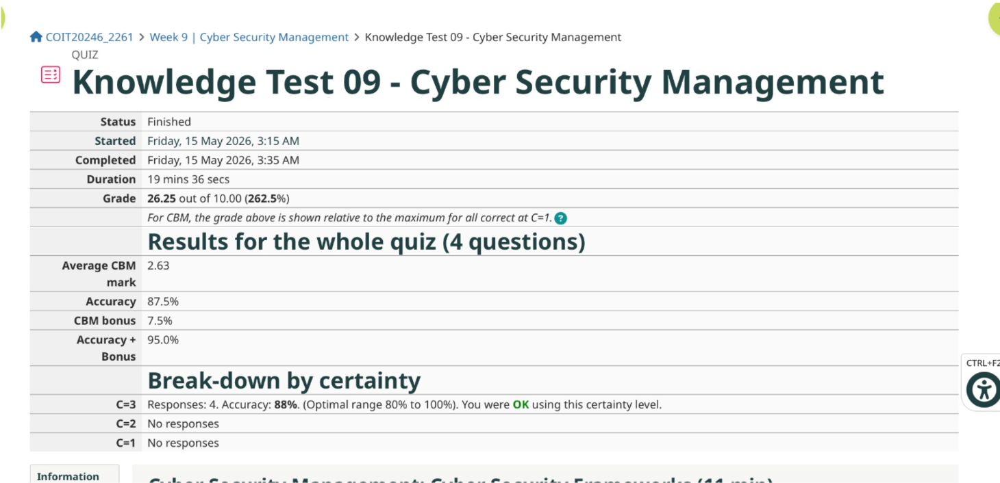
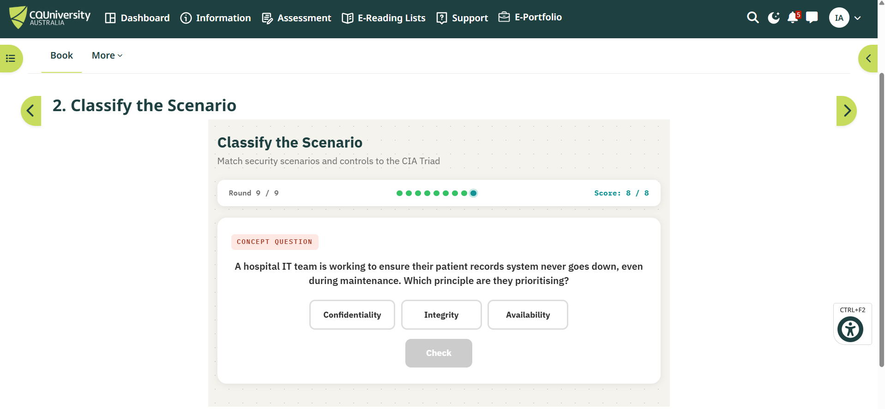
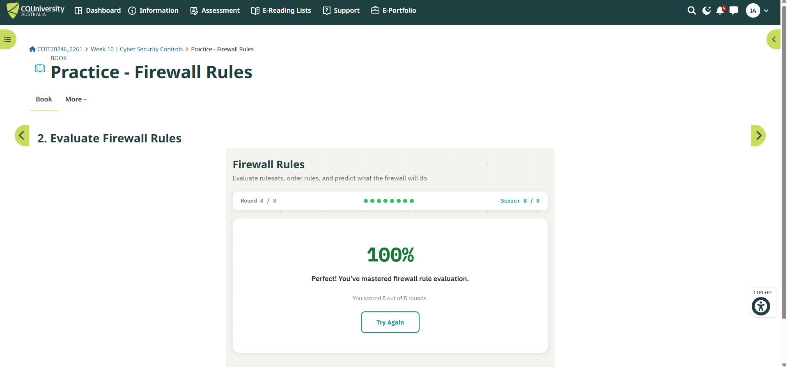
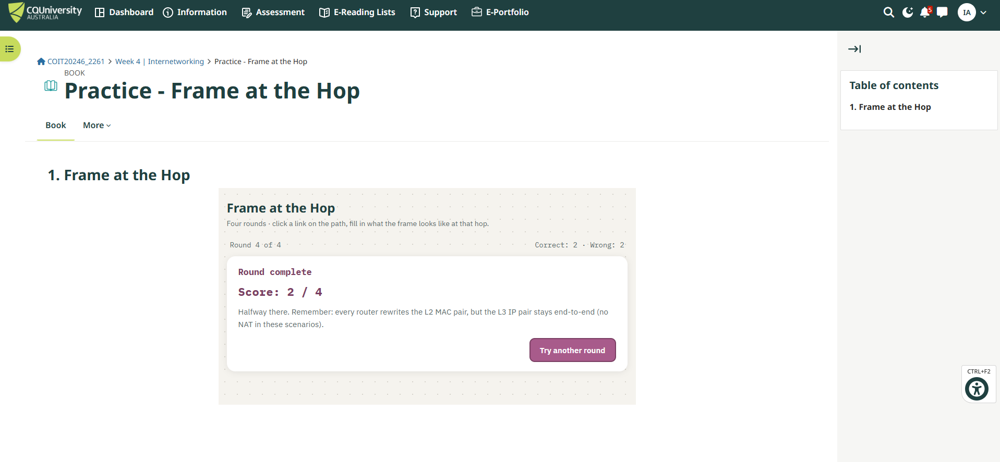

# Week 9 | Practice Activities

**Student Name:** Ilkhomjon Abdukarimov  
**Student ID:** 12326456  
**Campus:** Melbourne  
**Unit:** COIT20246 Networking and Cyber Security  
**Tutorial Topic:** Practice Activities  

---

## Task 1. Complete the Knowledge Test

The Week 9 Knowledge Test was completed on Moodle. The screenshot below should be included as evidence of completion.

---

## Task 2. Security Basics

For the Security Basics activity, I completed the **CIA Triad** practice activity. This activity focused on the three core information security principles: **Confidentiality**, **Integrity**, and **Availability**.

### Reflection on the Activity

The CIA Triad activity was useful because it tested whether I could correctly classify different security situations under the correct security principle. For example, protecting private information relates to confidentiality, preventing unauthorised modification relates to integrity, and ensuring systems remain accessible relates to availability. This helped reinforce that cybersecurity is not only about blocking attacks, but also about protecting the accuracy, privacy and accessibility of information systems.

This activity was practical because the scenarios were similar to real organisational security decisions. For example, a hospital patient-record system must prioritise availability so that healthcare staff can access records when required, while financial systems must strongly protect integrity so that transaction records cannot be changed without authorisation.

---

## Task 3. Security Techniques

For the Security Techniques activity, I completed the **Firewall Rules** practice activity. The result page showed a score of **8 out of 8**, which indicates that I correctly evaluated the firewall rule scenarios.

### Reflection on the Activity

The firewall rules activity was valuable because it helped me understand how network traffic is controlled using rule order, source, destination, ports and protocols. A firewall does not simply allow or block all traffic; it makes decisions based on specific rule conditions. This is important because an incorrectly ordered or overly broad rule can create a security weakness.

The activity improved my understanding of access control at the network level. For example, allowing HTTP traffic on TCP port 80 may be appropriate for a public web server, but allowing unnecessary inbound services would increase the attack surface. This connects with earlier practical work where network security group rules were used to permit only required traffic such as SSH and HTTP.

---

## Task 4. Addressing and Routing

For the Addressing and Routing activity, I completed the **Frame at the Hop** practice activity. This activity focused on how MAC addresses and IP addresses behave as traffic moves through a network.

### Reflection on the Activity

The Frame at the Hop activity helped clarify the difference between Layer 2 and Layer 3 addressing. The key lesson was that the **IP source and destination addresses remain end-to-end**, while the **MAC addresses change at each hop** as the frame is forwarded through routers. This is important for understanding packet forwarding, ARP, routing and Wireshark packet analysis.

Although my screenshot shows a result of **2 out of 4**, the activity was still useful because it identified an area for improvement. It reminded me that when a packet crosses a router, the router rewrites the Layer 2 frame with a new source and destination MAC address for the next link, but it normally keeps the original IP source and destination addresses unchanged unless NAT is involved.

---

## Task 5. Reflection on Learning Activities

### 5.1 Knowledge Tests and Lecture Videos

I used the weekly Knowledge Tests throughout the term to check my understanding of lecture topics. I usually spent around **10 to 15 minutes** on each Knowledge Test, depending on the topic. The Knowledge Tests were useful because they gave quick feedback and helped me identify which weekly concepts needed more revision. They were especially helpful before starting tutorial activities because they gave me a basic understanding of the theory behind the practical work.

Lecture videos and weekly learning materials were also useful because they explained the concepts before I applied them in practical tasks. However, I found that videos alone were not enough for deep learning. They were most useful when combined with practical work in GitHub and Moodle activities.

### 5.2 Weekly Journal in GitHub

The weekly GitHub journal was the most useful learning activity for me. I spent more time on the journal than on the Knowledge Tests because it required screenshots, commands, explanations, diagrams and correct file organisation. I usually spent **one to two hours or more** on journal tasks depending on the complexity of the week.

The GitHub journal helped me learn because it required me to document practical work clearly. For example, previous weeks required OpenWRT configuration, PowerShell commands, packet capture analysis, network diagrams, Azure screenshots and written explanations. This made the learning more realistic because I had to show evidence rather than only answer theory questions. It also improved my ability to organise technical files using consistent names and Markdown formatting.

### 5.3 Practice Activities

The Moodle Practice Activities were useful because they allowed me to revise important exam-style concepts interactively. I completed activities from Security Basics, Security Techniques and Addressing and Routing. These activities helped me test my knowledge in short practical scenarios rather than only reading notes.

The CIA Triad activity helped me revise core security principles. The Firewall Rules activity helped me understand how access control decisions are made. The Frame at the Hop activity helped me review how MAC and IP addresses are used across network hops. These practice activities were beneficial because they showed immediately whether my understanding was correct.

### 5.4 Most Useful Learning Activity

The most useful learning activity for this unit was the **weekly GitHub journal**. It required the strongest combination of theory, practice and documentation. The journal also helped me build a portfolio of technical evidence, including screenshots, network diagrams, commands and analysis. This made the learning more memorable than simply watching videos or completing short quizzes.

However, the best learning came from combining all three activities. Knowledge Tests helped me check theory, the GitHub journal helped me apply practical skills, and the Moodle Practice Activities helped me revise exam-style concepts. Together, these activities supported a stronger understanding of networking and cybersecurity.

---
